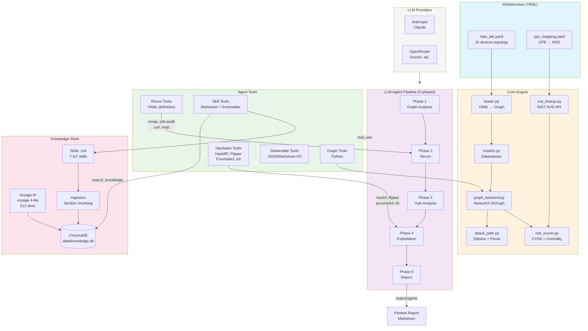
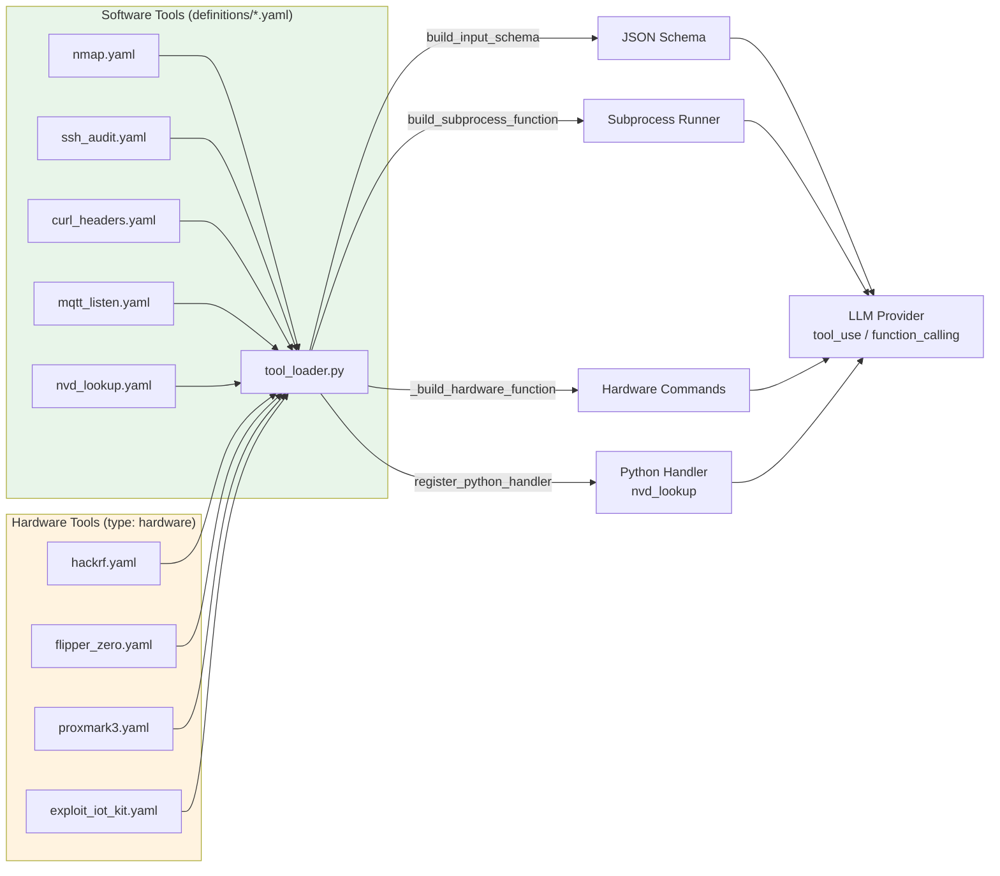
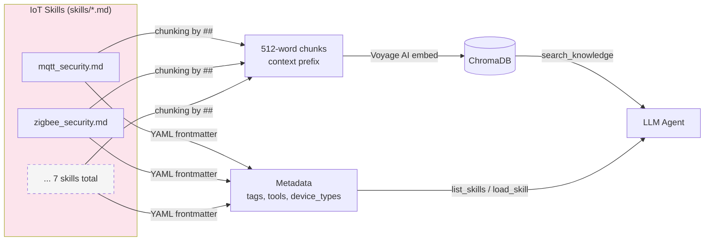

# NATO Smart City IoT - Attack Path Analysis Platform

## Overview

Cybersecurity platform for Smart City IoT infrastructures. Models a physical IoT lab network (192.168.88.0/24) as a directed graph to analyze vulnerabilities and detect multi-hop attack paths. Inspired by the Shannon/LLMDFA approach: LLM agents query the enriched graph to identify attack surfaces and generate pentest reports.

## Network Access

| Service | URL | Notes |
|---------|-----|-------|
| WisGate (LoRaWAN) | <http://192.168.88.238> | LoRaWAN Gateway EU868 |
| Zigbee2MQTT | <http://192.168.88.247:8080> | Zigbee Interface |
| MikroTik | 192.168.88.1 | Router/Firewall (WinBox) |
| TP-Link EAP613 | <http://192.168.88.251> | WiFi AP "NATO-Lab" |

### SSH

```bash
ssh nato@192.168.88.248  # Jetson Orin Nano
ssh nato@192.168.88.247  # Raspberry Pi 5
ssh nato@192.168.88.231  # IoT Hub
```

## Network Architecture

```
┌─────────────────────────────────────────────────────────────────────────────┐
│                              INTERNET                                       │
└─────────────────────────────────────────────────────────────────────────────┘
                                    │
                                    ▼
┌─────────────────────────────────────────────────────────────────────────────┐
│                         MikroTik RB5009 (.1)                                │
│                           Router/Firewall                                   │
└─────────────────────────────────────────────────────────────────────────────┘
                                    │
                                    ▼
┌─────────────────────────────────────────────────────────────────────────────┐
│                        Netgear GS348PP (PoE)                                │
│                           48-port Switch                                    │
└─────────────────────────────────────────────────────────────────────────────┘
        │          │          │          │          │          │          │
        ▼          ▼          ▼          ▼          ▼          ▼          ▼
  ┌─────────┐┌─────────┐┌─────────┐┌─────────┐┌─────────┐┌─────────┐┌─────────┐
  │TP-Link  ││WisGate  ││iot-hub  ││rpi-nato ││Jetson   ││Ubiquiti ││Ubiquiti │
  │EAP613   ││RAK7268  ││RPi5     ││RPi5     ││Orin Nano││AI Turret││NVR      │
  │.251     ││.238     ││.231     ││.247     ││.248     ││.230     ││.253     │
  │WiFi AP  ││LoRaWAN  ││MQTT     ││Zigbee   ││AI Vision││Camera   ││Video    │
  └─────────┘└─────────┘└─────────┘└─────────┘└─────────┘└─────────┘└─────────┘
       │          │          ▲          │                    │          │
       │          │          │          │                    └────┬─────┘
       ▼          │          │          │                         │
  ┌─────────┐     │          │          │                   ┌─────▼─────┐
  │WiFi     │     │          │          │                   │Video Feed │
  │Clients  │     │          │          │                   └───────────┘
  └─────────┘     │          │          │
                  │          │          │
            ┌─────┴─────┐    │    ┌─────┴─────┐
            │  LoRaWAN  │    │    │  Zigbee   │
            └───────────┘    │    └───────────┘
                  │          │          │
            ┌─────┴─────┐    │    ┌─────┴─────┐
            │Milesight  │    │    │Aqara      │
            │EM310-UDL  │    │    │Vibration  │
            │(ultrasonic)│   │    │Sensor     │
            └───────────┘    │    └───────────┘
                  │          │          │
                  │    ┌─────┴─────┐    │
                  └───►│   MQTT    │◄───┘
                       │   .231    │
                       └───────────┘
```

## IoT Protocols

| Protocol | Gateway | Sensors |
|----------|---------|---------|
| **LoRaWAN** | WisGate Edge Lite 2 | Milesight EM310-UDL, SenseCAP S2120, Elsys EMS, Dragino PS-LB |
| **Zigbee** | Sonoff ZBDongle-P (RPi5) | Aqara Vibration, Aqara Door/Window |
| **WiFi/BLE** | TP-Link EAP613 | Industrial Shields Ardbox |

## Hardware Inventory

| Device | Role | IP |
|--------|------|-----|
| MikroTik RB5009 | Router/Firewall | 192.168.88.1 |
| Netgear GS348PP | 48-port PoE Switch | - |
| Jetson Orin Nano | Edge AI, Vision | 192.168.88.248 |
| Raspberry Pi 5 | Zigbee Gateway | 192.168.88.247 |
| Raspberry Pi 4 | MQTT Broker | - |
| WisGate Edge Lite 2 | LoRaWAN Gateway | 192.168.88.238 |
| TP-Link EAP613 | WiFi AP NATO-Lab | 192.168.88.251 |

## Pipeline Architecture







## Tech Stack

- **NetworkX** — Graph backend for topology modeling and path analysis
- **PyYAML** — Declarative infrastructure model loading
- **pyvis** — Interactive network visualization (HTML export)
- **requests** — HTTP client for NIST NVD API (CVE lookup)
- **Anthropic SDK** — Claude API for the LLM agent pipeline
- **OpenAI SDK** — OpenAI-compatible API (OpenRouter, MiniMax, GLM, Qwen)
- **ChromaDB** — Persistent vector database for the knowledge store
- **Voyage AI** — Semantic embeddings (voyage-4-lite, 512 dims)
- **python-dotenv** — Environment variable loading (.env)
- **pytest** — Unit tests (193 tests, 14 files)
- **Zigbee2MQTT** — Zigbee → MQTT bridge (on RPi5)

## Getting Started

### 1. Install dependencies

```bash
pip install -r requirements.txt
```

### 2. Run tests

```bash
python3 -m pytest tests/ -v
```

### 3. Generate network visualization

```bash
python3 -m src.visualize
open output/nato_lab.html
```

### 4. Run attack path analysis

```bash
python3 -c "
from src.loader import build_graph
from src.cve_lookup import load_cpe_mapping, scan_all_devices
from src.attack_path import analyze_attack_paths, print_attack_report

backend = build_graph()
infra = __import__('src.loader', fromlist=['load_yaml']).load_yaml()
cpe = load_cpe_mapping('infrastructure/cpe_mapping.yaml')
cve_reports = scan_all_devices(infra, cpe)
report = analyze_attack_paths(backend, cve_reports)
print_attack_report(report)
"
```

### 5. Run the LLM agent pipeline

```bash
# Dry-run (validate without LLM calls)
python3 -m src.agent --dry-run --verbose

# Full run with Anthropic
python3 -m src.agent --provider anthropic --verbose

# Specific phases only
python3 -m src.agent --phases 1 3 5 --verbose
```

### 6. Ingest skills into the knowledge store

```bash
python3 -c "
from dotenv import load_dotenv; load_dotenv()
from src.agent.knowledge.ingest import ingest_skills
print(f'{ingest_skills()} chunks ingested')
"
```

### 7. Access the physical network

Connect to the `NATO-Lab` WiFi or plug into the switch.

```bash
# Check services
curl http://192.168.88.247:8080   # Zigbee2MQTT
curl http://192.168.88.238        # WisGate
```

## Repository Structure

```
NATO-SmartCity-IoT/
├── infrastructure/
│   ├── nato_lab.yaml              # Source of truth: lab topology (15 devices, 16 links)
│   └── cpe_mapping.yaml           # CPE → NVD mapping for CVE lookup
├── src/
│   ├── models.py                  # Dataclasses (Device, Service, Link, Network)
│   ├── graph_backend.py           # ABC GraphBackend + NetworkX implementation
│   ├── loader.py                  # YAML → dataclasses → graph
│   ├── cve_lookup.py              # NIST NVD module (CVE queries by CPE)
│   ├── risk_scorer.py             # Risk scoring (CVSS + exposure + centrality)
│   ├── attack_path.py             # Weighted attack paths + pivots (Dijkstra)
│   ├── visualize.py               # Interactive HTML generation (pyvis)
│   └── agent/
│       ├── __main__.py            # CLI: --provider, --model, --dry-run, --phases
│       ├── pipeline.py            # Multi-phase orchestrator with tool resolution
│       ├── provider.py            # LLM abstraction (Anthropic, OpenRouter, etc.)
│       ├── registry.py            # Declarative agent config for 5 phases
│       ├── prompt_manager.py      # Prompt templates with variable substitution
│       ├── cost_tracker.py        # Per-phase token/cost tracking
│       ├── tools/
│       │   ├── graph_tools.py     # Graph tools (load_lab_context, attack_surface, etc.)
│       │   ├── recon_tools.py     # Network recon tools (nmap, ssh-audit, curl, mqtt)
│       │   ├── tool_loader.py     # YAML → tool engine (subprocess + hardware + schema)
│       │   ├── skill_tools.py     # Skill tools (list, load, search, cve_search)
│       │   ├── deliverable.py     # File I/O (save/read/list deliverables)
│       │   └── definitions/       # YAML tool definitions (software + hardware)
│       │       ├── nmap.yaml            # Software: nmap -sV scanner
│       │       ├── ssh_audit.yaml       # Software: SSH config analyzer
│       │       ├── curl_headers.yaml    # Software: HTTP header checker
│       │       ├── mqtt_listen.yaml     # Software: MQTT passive listener
│       │       ├── nvd_lookup.yaml      # Software: NVD CVE search (Python handler)
│       │       ├── hackrf.yaml          # Hardware: SDR 1-6 GHz (Zigbee, LoRa, sub-GHz)
│       │       ├── flipper_zero.yaml    # Hardware: multi-tool (sub-GHz, RFID, NFC, IR)
│       │       ├── proxmark3.yaml       # Hardware: RFID/NFC badge cracking
│       │       └── exploit_iot_kit.yaml # Hardware: UART/JTAG/SPI/I2C/glitching
│       ├── knowledge/
│       │   ├── store.py           # ChromaDB wrapper (search, ingest, cache-then-query)
│       │   ├── embedder.py        # Voyage AI client (voyage-4-lite, 512 dims)
│       │   └── ingest.py          # Bulk ingestion (skill chunking by ##)
│       ├── skills/                # IoT security skills (Markdown + YAML frontmatter)
│       │   ├── mqtt_security.md
│       │   ├── ssh_hardening.md
│       │   ├── lorawan_analysis.md
│       │   ├── mikrotik_routeros.md
│       │   ├── web_service_analysis.md
│       │   ├── firmware_analysis.md
│       │   └── zigbee_security.md
│       ├── prompts/               # Per-phase prompt templates
│       └── validators/            # Output validators (markdown, json, file)
├── report/
│   ├── q4-2025.tex                # Q4 2025 progress report
│   ├── q1-2026.tex                # Q1 2026 progress report
│   └── slides-q1-2026.tex         # Q1 2026 presentation (Beamer)
├── tests/                         # 14 files, 193 tests
├── data/
│   └── knowledge.db/             # Persistent ChromaDB (generated)
├── output/
│   ├── nato_lab.html             # Network visualization
│   └── agent/<timestamp>/        # Per-run reports (01_graph..05_report)
└── requirements.txt
```

## Roadmap

### Phase 1 — Network Modeling ✅

- Declarative YAML infrastructure model
- NetworkX graph backend with abstract interface (swappable)
- Interactive pyvis visualization (HTML)
- Unit tests (loading, paths, attack surface)

### Phase 2 — CVE Enrichment ✅

1. Lab scanning with `nmap -sV` for service version detection
2. Firmware/OS version collection via SSH (RouterOS 7.18.2, Mosquitto 2.0.21, OpenSSH 10.0p1, etc.)
3. YAML enrichment with `os_version`, `firmware`, service `version`
4. NIST NVD module (`src/cve_lookup.py`) + CPE mapping (`infrastructure/cpe_mapping.yaml`)
5. Risk scoring (`src/risk_scorer.py`): CVSS + network exposure + betweenness centrality
6. Results: 24 CVEs across 5 devices, MikroTik (6.6) and WisGate (5.6) highest risk

### Phase 3 — Attack Path Analysis ✅

- Edge weighting by exploitation difficulty (protocol factor x CVSS exploitability)
- Distinction between network relays (switch/router/ap) and exploitation targets
- Critical attack path detection via directed Dijkstra
- Pivot point identification (Netgear betweenness 0.72, MikroTik 5 paths)
- Chain scoring: `∏ P(hop) × impact(target) × amplification^(n-1)`

#### Scoring Methodology

Attack path scoring relies on three components from the literature:

**1. Edge Weights — CVSS v3.1 Exploitability**

Each edge is weighted by the target device's exploitability, computed via the CVSS v3.1 formula:
`Exploitability = 8.22 × AV × AC × PR × UI` (normalized to probability [0,1]).
Numeric constants (AV, AC, PR, UI) come from the official specification [1].

**2. Protocol Factor**

For links without associated CVEs, a difficulty factor based on protocol type is applied (ethernet, MQTT, Zigbee, LoRaWAN), reflecting encryption, range, and required access.

**3. Path Score — Cumulative Probability + Amplification**

Attack path scoring combines:

- **Cumulative probability**: product of per-hop exploitation probabilities `P(path) = ∏ P(hop_i)`, following NIST's aggregation approach [2].
- **Target impact**: criticality of the final asset (CVSS Impact score).
- **Amplification factor**: chained vulnerabilities present greater risk than the sum of individual risks (domino effect, 1+1 > 2) [4]. Short paths with privilege escalation at each hop are penalized more.
- **Choke points**: nodes where multiple attack paths converge, identified via betweenness centrality [3].

#### References

1. FIRST — *CVSS v3.1 Specification Document*: exploitability formula and numeric constants.
   <https://www.first.org/cvss/v3-1/specification-document>
2. NIST — *Aggregating Vulnerability Metrics in Enterprise Networks using Attack Graphs*: probabilistic CVSS score aggregation along attack paths.
   <https://tsapps.nist.gov/publication/get_pdf.cfm?pub_id=926022>
3. Picus Security — *Attack Path Analysis Explained*: context-aware scoring (exploitability, path complexity, asset criticality) and choke point concept.
   <https://www.picussecurity.com/resource/blog/what-is-attack-path-analysis>
4. Software Secured — *The Domino Effect: Chaining Medium and Low Vulnerabilities is The Path to Critical Breaches*: propagation effect of chained vulnerabilities.
   <https://www.softwaresecured.com/post/the-domino-effect-chaining-medium-and-low-vulnerabilities-is-the-path-to-critical-breaches>
5. Park et al. — *Network Security Node-Edge Scoring System Using Attack Graph Based on Vulnerability Correlation*, Applied Sciences, 2022: combined node+edge scoring with vulnerability correlation.
   <https://www.mdpi.com/2076-3417/12/14/6852>
6. Frigault & Wang — *Using CVSS in Attack Graphs*: converting CVSS scores to attack graph edge weights.
   <https://www.researchgate.net/publication/221326700_Using_CVSS_in_attack_graphs>

### Phase 4 — LLM Pentester Agents ✅

Multi-phase pipeline inspired by Shannon/LLMDFA and CyberStrikeAI:

- **5 specialized agents**: graph analysis → recon → vuln analysis → exploitation → report
- **Multi-provider**: Anthropic (Claude), OpenRouter (Gemini), MiniMax, GLM, Qwen
- **Declarative YAML tools**: 9 tools in `definitions/*.yaml` (5 software + 4 hardware), extensible without Python
- **Hardware attack tools**: HackRF One (SDR), Flipper Zero (multi-tool), Proxmark3 Easy (RFID/NFC), Exploit IoT Kit (UART/JTAG/SPI). `type: hardware` returns operator command suggestions
- **IoT skills**: 7 Markdown skills with YAML frontmatter (MQTT, SSH, LoRaWAN, Zigbee, MikroTik, firmware, web). Skills cross-reference hardware tools
- **Knowledge Store**: ChromaDB + Voyage AI (voyage-3.5-lite, 512 dims) for semantic search over CVEs and skills (46 chunks)
- **Cost tracking**: per-phase token/cost tracking (~$0.38 for a full run)
- **Dry-run**: pipeline validation without LLM API calls

### Phase 5 — Progressive Pentesting

Testing attack scenarios on the physical lab, by increasing difficulty:

| Level | Scenario | Example |
|-------|----------|---------|
| 1 | Single device, exposed service | HTTP exploit on WisGate |
| 2 | Single device, unauthenticated MQTT | Sensor data interception |
| 3 | 2-hop chaining | LoRaWAN sensor → WisGate → MQTT broker |
| 4 | Full multi-hop scenario | Internet → MikroTik → LAN pivot → internal target |

#### Testing Strategy

| Attack | Environment | Reason |
|--------|-------------|--------|
| Unauthenticated MQTT (`mosquitto_sub -t '#'`) | Real lab | Non-destructive, passive listening |
| SSH default creds | Real lab | Non-destructive, simple login test |
| Terrapin SSH scan (`ssh-audit`) | Real lab | Non-destructive, passive scan |
| MikroTik DoS (CVE-2018-5951) | Docker/GNS3 | Risk of network outage |
| nginx RCE (CVE-2021-23017) | Container `nginx:1.19.6` | Risk of crashing WisGate |
| Dropbear exploit (CVE-2021-36369) | Container | Risk of losing SSH access |

Destructive attacks (DoS, RCE, SSH exploits) are tested on **Docker containers** that reproduce vulnerable services with the same versions as the real lab. This validates exploits without impacting the infrastructure.

#### Hardware Attack Tools

| Tool | Type | Lab Applications |
|------|------|-----------------|
| **HackRF One** | SDR (1-6 GHz) | Zigbee 802.15.4 sniffing (ch 11-26), LoRaWAN EU868 capture, GNU Radio decoding |
| **Flipper Zero** | Multi-tool | Sub-GHz replay, RFID/NFC emulation, GPIO/UART bridging |
| **Proxmark3 Easy** | RFID/NFC | Mifare Classic cracking (darkside, hardnested), badge cloning |
| **Exploit IoT Kit** | HW hacking | UART console on WisGate, JTAG debug, SPI flash dump, firmware extraction |

Hardware tools are integrated as declarative YAML definitions (`type: hardware`). The agent recommends protocol-specific commands; the operator executes with physical access. Available in Phases 2-4 via the `recon` tool group.

### Phase 6 — Dashboard + Advanced Graph Backend (optional)

- Real-time web dashboard (network status, alerts, visualized attack paths)
- If more complex queries are needed: implement a Memgraph or Neo4j backend (the `GraphBackend` ABC is ready for this)
