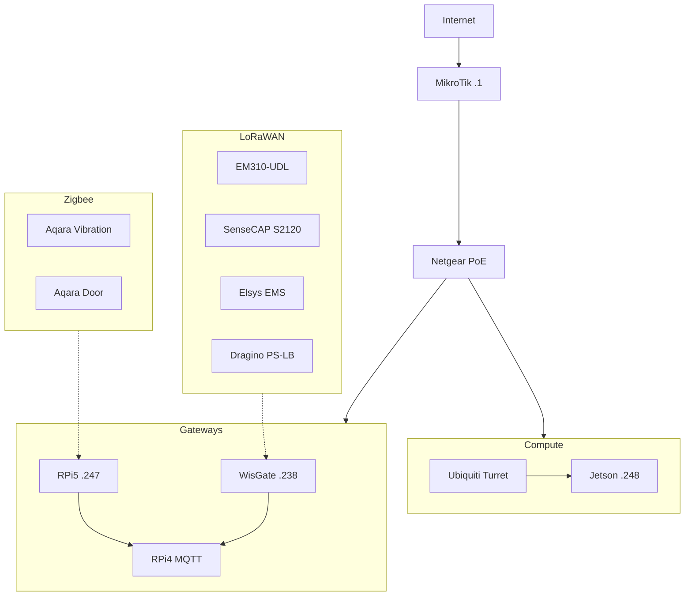

# NATO Smart City IoT - Plateforme d'Analyse des Chemins d'Attaque

## 🎯 Objectif

Plateforme de cybersécurité pour infrastructures IoT Smart City. Analyse des vulnérabilités et détection des chemins d'attaque multi-hop via Neo4j, avec enrichissement automatique NIST NVD.

## 🌐 Accès Réseau

| Service | URL | Notes |
|---------|-----|-------|
| WisGate (LoRaWAN) | <http://192.168.88.238> | Gateway LoRaWAN EU868 |
| Zigbee2MQTT | <http://192.168.88.247:8080> | Interface Zigbee |
| MikroTik | 192.168.88.1 | Routeur/Firewall (WinBox) |
| TP-Link EAP613 | <http://192.168.88.251> | AP WiFi "NATO-Lab" |
| Homebox | <http://ilia-corsair-5000x.umons.ac.be:7745> | Inventaire matériel |

### SSH

```bash
ssh nato@192.168.88.248  # Jetson Orin Nano
ssh nato@192.168.88.247  # Raspberry Pi 5
ssh tanguy@ilia-corsair-5000x.umons.ac.be  # Tour UMONS
```

## 🏗️ Architecture Réseau



## 📡 Protocoles IoT

| Protocole | Gateway | Capteurs |
|-----------|---------|----------|
| **LoRaWAN** | WisGate Edge Lite 2 | Milesight EM310-UDL, SenseCAP S2120, Elsys EMS |
| **Zigbee** | Sonoff ZBDongle-P (RPi5) | Aqara Vibration, Aqara Door/Window |
| **WiFi/BLE** | TP-Link EAP613 | Industrial Shields Ardbox |

## 📦 Inventaire

Inventaire complet sur [Homebox](http://ilia-corsair-5000x.umons.ac.be:7745)

### Matériel principal

| Device | Rôle | IP |
|--------|------|-----|
| MikroTik RB5009 | Routeur/Firewall | 192.168.88.1 |
| Netgear GS348PP | Switch PoE 48 ports | - |
| Jetson Orin Nano | Edge AI, Vision | 192.168.88.248 |
| Raspberry Pi 5 | Gateway Zigbee | 192.168.88.247 |
| WisGate Edge Lite 2 | Gateway LoRaWAN | 192.168.88.238 |

## 🛠️ Stack Logicielle

- **Neo4j** : Base de données graphe (topologie + vulnérabilités)
- **MongoDB** : Cache vulnérabilités NIST NVD
- **Zigbee2MQTT** : Bridge Zigbee → MQTT
- **Docker** : Conteneurisation des services
- **MCP + Ollama** : Requêtes langage naturel

## 🚀 Getting Started

### 1. Accéder au réseau

Connecte-toi au WiFi `NATO-Lab` ou branche-toi sur le switch.

### 2. Vérifier les services

```bash
# Zigbee2MQTT
curl http://192.168.88.247:8080

# WisGate
curl http://192.168.88.238
```

### 3. Consulter l'inventaire

Ouvre [Homebox](http://ilia-corsair-5000x.umons.ac.be:7745) pour voir le matériel disponible.

## 📁 Structure du repo

```
NATO-SmartCity-IoT/
├── README.md
├── docs/
│   ├── architecture.md
│   ├── setup-lorawan.md
│   └── setup-zigbee.md
├── src/
│   ├── neo4j/
│   └── scripts/
└── configs/
```

## 👥 Équipe

- Tanguy Van Schoelandt

## 📄 Licence

Projet NATO - Usage interne uniquement
