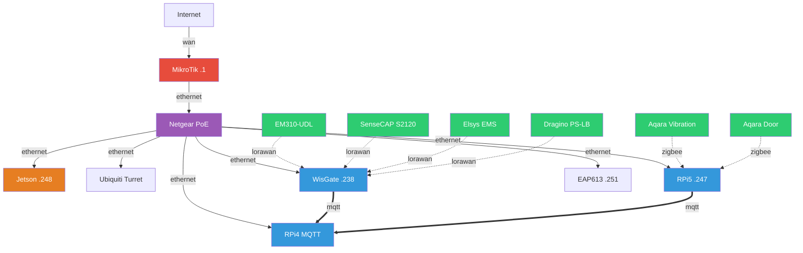

# NATO Smart City IoT - Plateforme d'Analyse des Chemins d'Attaque

## 🎯 Objectif

Plateforme de cybersécurité pour infrastructures IoT Smart City. Modélisation du réseau sous forme de graphe dirigé pour analyser les vulnérabilités et détecter les chemins d'attaque multi-hop. Inspirée de l'approche Shannon/LLMDFA : des agents IA interrogent le graphe pour identifier les surfaces d'attaque.

## 🌐 Accès Réseau

| Service | URL | Notes |
|---------|-----|-------|
| WisGate (LoRaWAN) | <http://192.168.88.238> | Gateway LoRaWAN EU868 |
| Zigbee2MQTT | <http://192.168.88.247:8080> | Interface Zigbee |
| MikroTik | 192.168.88.1 | Routeur/Firewall (WinBox) |
| TP-Link EAP613 | <http://192.168.88.251> | AP WiFi "NATO-Lab" |
| Homebox | <http://ilia-corsair-5000x.umons.ac.be:7745> | Inventaire matériel |

### SSH

```bash
ssh nato@192.168.88.248  # Jetson Orin Nano
ssh nato@192.168.88.247  # Raspberry Pi 5
ssh tanguy@ilia-corsair-5000x.umons.ac.be  # Tour UMONS
```

## 🏗️ Architecture Réseau



## 📡 Protocoles IoT

| Protocole | Gateway | Capteurs |
|-----------|---------|----------|
| **LoRaWAN** | WisGate Edge Lite 2 | Milesight EM310-UDL, SenseCAP S2120, Elsys EMS, Dragino PS-LB |
| **Zigbee** | Sonoff ZBDongle-P (RPi5) | Aqara Vibration, Aqara Door/Window |
| **WiFi/BLE** | TP-Link EAP613 | Industrial Shields Ardbox |

## 📦 Inventaire

Inventaire complet sur [Homebox](http://ilia-corsair-5000x.umons.ac.be:7745)

### Matériel principal

| Device | Rôle | IP |
|--------|------|-----|
| MikroTik RB5009 | Routeur/Firewall | 192.168.88.1 |
| Netgear GS348PP | Switch PoE 48 ports | - |
| Jetson Orin Nano | Edge AI, Vision | 192.168.88.248 |
| Raspberry Pi 5 | Gateway Zigbee | 192.168.88.247 |
| Raspberry Pi 4 | MQTT Broker | - |
| WisGate Edge Lite 2 | Gateway LoRaWAN | 192.168.88.238 |
| TP-Link EAP613 | AP WiFi NATO-Lab | 192.168.88.251 |

## 🛠️ Stack Logicielle

- **NetworkX** : Backend graphe pour la modélisation de topologie et l'analyse de chemins
- **PyYAML** : Chargement du modèle d'infrastructure déclaratif
- **pyvis** : Visualisation interactive du réseau (export HTML)
- **pytest** : Tests unitaires
- **Zigbee2MQTT** : Bridge Zigbee → MQTT (sur RPi5)

## 🚀 Getting Started

### 1. Installation

```bash
pip install -r requirements.txt
```

### 2. Lancer les tests

```bash
python3 -m pytest tests/ -v
```

### 3. Générer la visualisation

```bash
python3 -m src.visualize
open output/nato_lab.html
```

### 4. Accéder au réseau physique

Connecte-toi au WiFi `NATO-Lab` ou branche-toi sur le switch.

```bash
# Vérifier les services
curl http://192.168.88.247:8080   # Zigbee2MQTT
curl http://192.168.88.238        # WisGate
```

## 📁 Structure du repo

```
NATO-SmartCity-IoT/
├── infrastructure/
│   └── nato_lab.yaml          # Source de vérité : topologie du lab
├── src/
│   ├── models.py              # Dataclasses (Device, Service, Link, Network)
│   ├── graph_backend.py       # ABC GraphBackend + implémentation NetworkX
│   ├── loader.py              # YAML → dataclasses → graphe
│   └── visualize.py           # Génération HTML interactive (pyvis)
├── tests/
│   └── test_loader.py         # Tests : chargement, chemins, surface d'attaque
├── output/
│   └── nato_lab.html          # Visualisation générée
└── requirements.txt
```

## 👥 Équipe

- Tanguy Van Schoelandt

## 📄 Licence

Projet NATO - Usage interne uniquement
