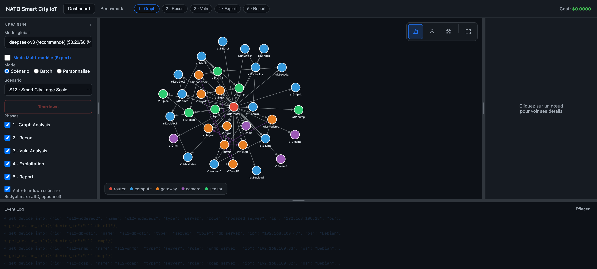
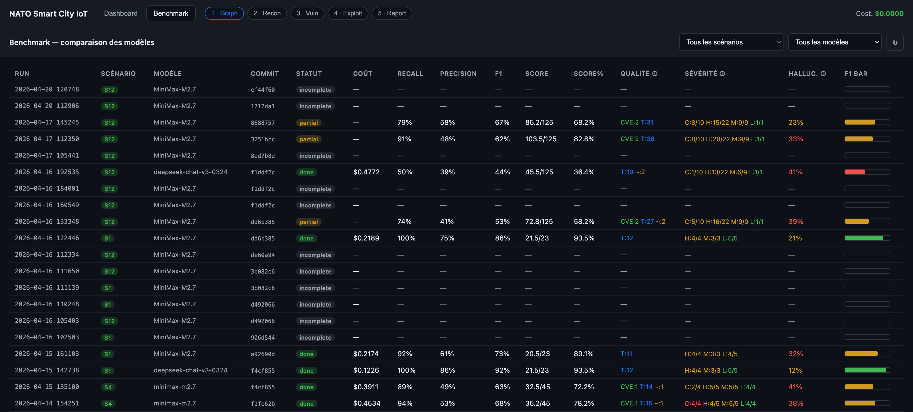
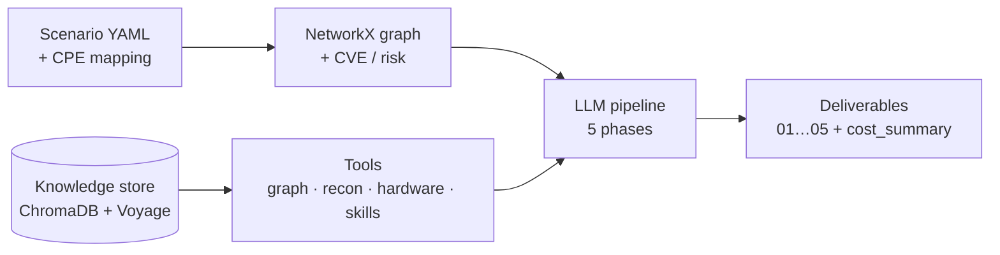

# NATO Smart City IoT — Attack Path Analysis Platform

## Overview

Cybersecurity platform for Smart City IoT infrastructures. Models an IoT network as a directed graph, runs a multi-phase LLM agent pipeline (inspired by Shannon / LLMDFA) that reconnoitres, exploits, and reports on detected vulnerabilities, and scores every run against a ground truth. The platform primarily operates on **disposable Proxmox scenarios** — never against production hardware — and ships three modes:

- **Benchmark mode** — runs 14 scripted scenarios on Proxmox (`192.168.100.0/24`, isolated `vmbr1` bridge) to score LLMs against ground-truth YAMLs (Recall / Precision / F1 / weighted Score).
- **Discovery mode** (Docker) — starts with an empty graph, nmap-discovers any target network from a user-supplied CIDR, displays hosts live in the dashboard.
- **Reference lab mode** — the `S3 · Réplique NATO Lab` scenario mirrors the real IoT lab topology (LoRaWAN / Zigbee / MQTT / cameras) inside Proxmox, so the same pipeline can be validated against an NATO-Lab-like environment without touching physical devices.

## Dashboard

The FastAPI + SPA dashboard runs on the master VM (Tailscale) and on the Docker image. It drives every benchmark run: select a scenario, pick an LLM (or one per phase in Expert mode), stream events live, and inspect past runs / scores.



**Left panel** — new run config (global / per-phase model, scenario selector, phases, budget) + run history.
**Center** — interactive Cytoscape topology of the selected scenario (organic / hierarchical / concentric layouts). Node colors = device type (router · compute · gateway · camera · sensor).
**Right** — Event Log (SSE stream): every `tool_call` / `tool_result` of each phase, with expandable JSON.
**Top bar** — Dashboard / Benchmark tabs, phase status pills (running / done / failed), running cost.

## Testing environment — Proxmox + scenarios

All offensive testing happens on disposable VMs on a **Proxmox** hypervisor, never against the physical lab:

- **Master VM** (`LXC 200` on Proxmox) runs the FastAPI dashboard, the LLM pipeline, and the Ansible controller. Reachable via Tailscale (`nato-master.tail6b8e31.ts.net:8501`).
- **Isolated test bridge** `vmbr1` — `192.168.100.0/24`. All nmap / ssh-audit / mqtt / modbus scans are pinned to this bridge via iptables on the master's `eth1`.
- **Scenario** = one OpenWrt router (VMID `1N0`) + N Debian LXC services (VMIDs `1N1`…`1N9`) cloned from Proxmox templates (`9000` / `9010`).
- **Ansible pipeline** — `deploy_master.yml` provisions the master once; then for each scenario: `03_deploy_scenario → 04_inject_vulns → 05_populate_services → 06_verify → 99_teardown`, all triggered from the dashboard or CLI.

### Scenarios available in the dashboard

| ID | Name | Theme |
|----|------|-------|
| `S1` / `S1h` | Réseau plat / hardened | Flat network, minimal services |
| `S2` | Gateway exposée | Internet-facing IoT gateway |
| `S3` | Réplique NATO Lab | Mirror of the physical lab (wisgate / rpi5 / iot-hub / jetson / ap / cam / nvr) |
| `S4` / `S4h` | Réseau segmenté (ICS/SCADA) / hardened | PLC + HMI + historian, segmented admin zone |
| `S5` | Smart Building | Cameras + NVR + access control + HVAC |
| `S6` | Domotique centralisée | Home hub + MQTT + DB + cam + web |
| `S7` | Edge-Cloud pivot | Edge gateway ↔ cloud API/DB pivot |
| `S8` | Multi-zone IT/IoT/OT | Three-tier segmentation |
| `S9` | Mesh IoT | Mesh topology |
| `S10` | Flat avec variantes | Hardening A/B variants |
| `S11` | Smart City 3 zones | Multi-zone smart-city |
| `S12` | Smart City Large Scale | 35 devices — IT / IoT / OT / cameras / PLCs (shown in screenshot above) |

Full scenario definitions, ground truth, and playbook reference: see [benchmarks/README.md](benchmarks/README.md) and [benchmarks/ansible/README.md](benchmarks/ansible/README.md).

## Benchmark tab — model comparison

Each run's `04_exploitation.json` (falling back to `03_vuln_analysis.json`) is matched against `benchmarks/ground_truth/scenario_N.yaml` and scored: Recall, Precision, F1, weighted Score (CRITICAL=4 / HIGH=3 / MEDIUM=2 / LOW=1), with penalties for severity mismatch (×0.75) and loose-category matches (×0.5). Runs can be filtered by scenario and model, and added to a comparison basket.



## Pipeline Architecture



**Pipeline** — 5 phases, each with its own prompt and tool set: **graph analysis → recon → vuln analysis (parallel per device) → exploitation (parallel per vuln) → report**. Each phase's output is a deliverable consumed by the next.

**Tools** — 18 declarative YAML definitions (software subprocess · hardware command suggestions · Python handler for NVD) loaded by `tool_loader.py`, plus Python-native graph and deliverable tools.

**Knowledge** — 8 Markdown skills (MQTT, SSH, LoRaWAN, Zigbee, MikroTik, firmware, web, report methodology) chunked by `##` and embedded with Voyage AI into ChromaDB for `search_knowledge`.

## Tech Stack

- **NetworkX** — Graph backend for topology modeling and path analysis
- **PyYAML** — Declarative infrastructure model loading
- **pyvis** — Interactive network visualization (HTML export)
- **requests** — HTTP client for NIST NVD API (CVE lookup)
- **Anthropic SDK** — Claude API for the LLM agent pipeline
- **OpenAI SDK** — OpenAI-compatible API (OpenRouter, MiniMax, GLM, Qwen)
- **ChromaDB** — Persistent vector database for the knowledge store
- **Voyage AI** — Semantic embeddings (voyage-3.5-lite, 512 dims)
- **FastAPI + SSE** — Backend dashboard streaming pipeline events to the SPA
- **Cytoscape.js** — Interactive topology graph in the dashboard
- **Docker / GHCR** — Multi-arch end-user image (`ghcr.io/tanguyvans/nato-smartcity-iot`)
- **python-dotenv** — Environment variable loading (.env)
- **pytest** — Unit tests (276 tests, 15 files)
- **Zigbee2MQTT** — Zigbee → MQTT bridge (on RPi5)

## Getting Started

### 1. Install dependencies

```bash
pip install -r requirements.txt
```

### 2. Run tests

```bash
python3 -m pytest tests/ -v
```

### 3. Generate network visualization

```bash
python3 -m src.visualize
open output/nato_lab.html
```

### 4. Run attack path analysis

```bash
python3 -c "
from src.loader import build_graph
from src.cve_lookup import load_cpe_mapping, scan_all_devices
from src.attack_path import analyze_attack_paths, print_attack_report

backend = build_graph()
infra = __import__('src.loader', fromlist=['load_yaml']).load_yaml()
cpe = load_cpe_mapping('infrastructure/cpe_mapping.yaml')
cve_reports = scan_all_devices(infra, cpe)
report = analyze_attack_paths(backend, cve_reports)
print_attack_report(report)
"
```

### 5. Run the LLM agent pipeline

```bash
# Dry-run (validate without LLM calls)
python3 -m src.agent --dry-run --verbose

# Full run with Anthropic
python3 -m src.agent --provider anthropic --verbose

# Specific phases only
python3 -m src.agent --phases 1 3 5 --verbose
```

### 6. Ingest skills into the knowledge store

```bash
python3 -c "
from dotenv import load_dotenv; load_dotenv()
from src.agent.knowledge.ingest import ingest_skills
print(f'{ingest_skills()} chunks ingested')
"
```

### 7. Launch the dashboard (FastAPI + SPA)

```bash
uvicorn src.api.main:app --host 0.0.0.0 --port 8501
# → http://localhost:8501
```

Tabs:

- **Dashboard** — Configure provider/model (per phase in Expert mode), pick a lab/scenario/target network, start a pipeline, watch live events via SSE, explore the Cytoscape topology (nodes appear live in Discovery mode).
- **Benchmark** — Recall / Precision / F1 / weighted Score for each past run evaluated against a ground truth.
- **Runs** — Download past deliverables (`01_graph_analysis.md` … `05_report.md`) or a full ZIP.

### 8. Run the end-user Docker image (Discovery mode)

```bash
cp .env.example .env   # fill in OPENROUTER_API_KEY, VOYAGE_API_KEY
docker compose up
# → http://localhost:8501
```

The simplified frontend (`src/static_docker/`) asks for a CIDR (`Réseau cible`), scans it with nmap, and adds hosts to the graph as they are discovered. No lab topology is preloaded.


## Repository Structure

```
NATO-SmartCity-IoT/
├── infrastructure/
│   ├── nato_lab.yaml              # Source of truth: lab topology (15 devices, 16 links)
│   └── cpe_mapping.yaml           # CPE → NVD mapping for CVE lookup
├── src/
│   ├── models.py                  # Dataclasses (Device, Service, Link, Network)
│   ├── graph_backend.py           # ABC GraphBackend + NetworkX implementation
│   ├── loader.py                  # YAML → dataclasses → graph
│   ├── cve_lookup.py / cve_cli.py # NIST NVD module + CLI
│   ├── risk_scorer.py / risk_cli.py
│   ├── attack_path.py             # Weighted attack paths + pivots (Dijkstra)
│   ├── visualize.py               # Interactive HTML generation (pyvis)
│   ├── api/                       # FastAPI dashboard backend
│   │   ├── main.py                # App entry (mounts routers + static files)
│   │   └── routes/
│   │       ├── pipeline.py        # Start / SSE stream / Stop
│   │       ├── runs.py            # History, per-run files, score, ZIP download
│   │       ├── topology.py        # Lab / scenario / empty graph (Cytoscape)
│   │       ├── scenarios.py       # Benchmark scenarios listing
│   │       └── models.py          # LLM models catalog
│   ├── static/                    # Full dashboard (benchmark + expert mode)
│   ├── static_docker/             # Simplified end-user SPA (CIDR + discovery)
│   ├── benchmark/
│   │   └── evaluator.py           # TP/FP/FN matching, weighted F1, severity rules
│   ├── ui/app.py                  # (legacy Streamlit UI, kept for reference)
│   └── agent/
│       ├── __main__.py            # CLI: --provider, --model, --dry-run, --phases
│       ├── pipeline.py            # Multi-phase orchestrator with tool resolution
│       ├── orchestrator.py        # Higher-level run control (threaded exec)
│       ├── batch.py               # Parallel per-device sub-agent execution (Phase 3)
│       ├── scanner.py             # Network sweep helpers for discovery mode
│       ├── provider.py            # LLM abstraction (Anthropic, OpenRouter, MiniMax, GLM, Qwen)
│       ├── registry.py            # Declarative agent config for 5 phases
│       ├── prompt_manager.py      # Prompt templates with variable substitution
│       ├── cost_tracker.py        # Per-phase token/cost tracking
│       ├── pricing.py             # Pricing tables (per-provider, per-model)
│       ├── vuln_taxonomy.py       # Single source of truth for vuln types / aliases / noise
│       ├── tools/
│       │   ├── graph_tools.py     # load_lab_context / load_scenario_topology / load_discovery_context
│       │   ├── recon_tools.py     # Auto-generated tools + nvd_lookup handler
│       │   ├── tool_loader.py     # YAML → subprocess/handler/hardware tool engine
│       │   ├── skill_tools.py     # list_skills / load_skill / search_knowledge / cve_search
│       │   ├── deliverable.py     # save/read/list deliverables + aggregate_device_results
│       │   └── definitions/       # 18 YAML tool definitions
│       │       ├── nmap.yaml, nmap_discovery.yaml, arp_scan.yaml
│       │       ├── ssh_audit.yaml, ssh_login.yaml, telnet_connect.yaml
│       │       ├── curl_headers.yaml, http_get.yaml, ftp_list.yaml
│       │       ├── mqtt_listen.yaml, modbus_scan.yaml
│       │       ├── mysql_query.yaml, redis_cmd.yaml
│       │       ├── nvd_lookup.yaml                     # Python handler
│       │       └── hackrf.yaml, flipper_zero.yaml,
│       │           proxmark3.yaml, exploit_iot_kit.yaml  # type: hardware
│       ├── knowledge/
│       │   ├── store.py           # ChromaDB wrapper (search, ingest, cache-then-query)
│       │   ├── embedder.py        # Voyage AI client (voyage-3.5-lite, 512 dims)
│       │   └── ingest.py          # Bulk ingestion (skill chunking by ##)
│       ├── skills/                # 8 IoT security skills (Markdown + YAML frontmatter)
│       │   ├── mqtt_security.md, ssh_hardening.md, lorawan_analysis.md,
│       │   ├── mikrotik_routeros.md, web_service_analysis.md, firmware_analysis.md,
│       │   ├── zigbee_security.md, report_methodology.md
│       ├── prompts/               # Per-phase prompt templates + shared context
│       ├── templates/             # Deliverable skeletons
│       └── validators/            # Output validators (markdown, json, file)
├── benchmarks/                    # IoT Security Benchmark (Proxmox + Ansible)
│   ├── README.md                  # Benchmark overview (scenarios, metrics, playbooks)
│   ├── ansible/                   # Playbooks + roles (see benchmarks/ansible/README.md)
│   ├── scenarios/                 # S1…S12 + S1h, S4h (hard variants)
│   ├── ground_truth/              # scenario_N.yaml — expected vulns, severities, CVEs
│   ├── packs/                     # Reusable vuln + topology building blocks
│   ├── topologies/                # Reference topologies
│   ├── templates/                 # Ground-truth / scenario YAML templates
│   ├── tools/                     # Benchmark helper scripts
│   └── results/                   # Benchmark outputs
├── ansible/                       # Hardening roles (firewall, monitoring, ssh/mqtt_hardening)
│                                  #  — used for the "hardened posture" of scenarios
├── docker/
│   └── entrypoint.sh              # Auto-ingests skills on first boot
├── Dockerfile / docker-compose.yml / .env.example
├── .github/workflows/             # CI: docker multi-arch build, master-VM update runner
├── docs/                          # Architecture notes (benchmark refactor, scalability)
├── report/                        # LaTeX progress reports / Beamer slides
├── paper/                         # Papers in progress
├── tests/                         # 15 files, 276 tests
├── data/knowledge.db/             # Persistent ChromaDB (generated)
├── output/
│   ├── nato_lab.html              # Network visualization
│   └── agent/<timestamp>/         # Per-run deliverables + cost_summary.json
└── requirements.txt
```

## Roadmap

### Phase 1 — Network Modeling ✅

- Declarative YAML infrastructure model
- NetworkX graph backend with abstract interface (swappable)
- Interactive pyvis visualization (HTML)
- Unit tests (loading, paths, attack surface)

### Phase 2 — CVE Enrichment ✅

1. Lab scanning with `nmap -sV` for service version detection
2. Firmware/OS version collection via SSH (RouterOS 7.18.2, Mosquitto 2.0.21, OpenSSH 10.0p1, etc.)
3. YAML enrichment with `os_version`, `firmware`, service `version`
4. NIST NVD module (`src/cve_lookup.py`) + CPE mapping (`infrastructure/cpe_mapping.yaml`)
5. Risk scoring (`src/risk_scorer.py`): CVSS + network exposure + betweenness centrality
6. Results: 24 CVEs across 5 devices, MikroTik (6.6) and WisGate (5.6) highest risk

### Phase 3 — Attack Path Analysis ✅

- Edge weighting by exploitation difficulty (protocol factor x CVSS exploitability)
- Distinction between network relays (switch/router/ap) and exploitation targets
- Critical attack path detection via directed Dijkstra
- Pivot point identification (Netgear betweenness 0.72, MikroTik 5 paths)
- Chain scoring: `∏ P(hop) × impact(target) × amplification^(n-1)`

#### Scoring Methodology

Attack path scoring relies on three components from the literature:

**1. Edge Weights — CVSS v3.1 Exploitability**

Each edge is weighted by the target device's exploitability, computed via the CVSS v3.1 formula:
`Exploitability = 8.22 × AV × AC × PR × UI` (normalized to probability [0,1]).
Numeric constants (AV, AC, PR, UI) come from the official specification [1].

**2. Protocol Factor**

For links without associated CVEs, a difficulty factor based on protocol type is applied (ethernet, MQTT, Zigbee, LoRaWAN), reflecting encryption, range, and required access.

**3. Path Score — Cumulative Probability + Amplification**

Attack path scoring combines:

- **Cumulative probability**: product of per-hop exploitation probabilities `P(path) = ∏ P(hop_i)`, following NIST's aggregation approach [2].
- **Target impact**: criticality of the final asset (CVSS Impact score).
- **Amplification factor**: chained vulnerabilities present greater risk than the sum of individual risks (domino effect, 1+1 > 2) [4]. Short paths with privilege escalation at each hop are penalized more.
- **Choke points**: nodes where multiple attack paths converge, identified via betweenness centrality [3].

#### References

1. FIRST — *CVSS v3.1 Specification Document*: exploitability formula and numeric constants.
   <https://www.first.org/cvss/v3-1/specification-document>
2. NIST — *Aggregating Vulnerability Metrics in Enterprise Networks using Attack Graphs*: probabilistic CVSS score aggregation along attack paths.
   <https://tsapps.nist.gov/publication/get_pdf.cfm?pub_id=926022>
3. Picus Security — *Attack Path Analysis Explained*: context-aware scoring (exploitability, path complexity, asset criticality) and choke point concept.
   <https://www.picussecurity.com/resource/blog/what-is-attack-path-analysis>
4. Software Secured — *The Domino Effect: Chaining Medium and Low Vulnerabilities is The Path to Critical Breaches*: propagation effect of chained vulnerabilities.
   <https://www.softwaresecured.com/post/the-domino-effect-chaining-medium-and-low-vulnerabilities-is-the-path-to-critical-breaches>
5. Park et al. — *Network Security Node-Edge Scoring System Using Attack Graph Based on Vulnerability Correlation*, Applied Sciences, 2022: combined node+edge scoring with vulnerability correlation.
   <https://www.mdpi.com/2076-3417/12/14/6852>
6. Frigault & Wang — *Using CVSS in Attack Graphs*: converting CVSS scores to attack graph edge weights.
   <https://www.researchgate.net/publication/221326700_Using_CVSS_in_attack_graphs>

### Phase 4 — LLM Pentester Agents ✅

Multi-phase pipeline inspired by Shannon/LLMDFA and CyberStrikeAI:

- **5 specialized agents**: graph analysis → recon → vuln analysis → exploitation → report
- **Parallel sub-agents (Phase 3 & 4)**: Per-device vulnerability analysis and per-vuln exploitation run in parallel (`src/agent/batch.py`), merged back by `_aggregate_device_vulns` / `_aggregate_exploit_results`.
- **Multi-model pipeline**: Choose a different LLM per phase (Expert Mode in the dashboard).
- **Multi-provider**: Anthropic (Claude), OpenRouter (Gemini, DeepSeek, GPT-4o), MiniMax, GLM, Qwen.
- **18 declarative YAML tools** — software (nmap, nmap_discovery, arp_scan, ssh_audit, ssh_login, telnet_connect, curl_headers, http_get, ftp_list, mqtt_listen, modbus_scan, mysql_query, redis_cmd, nvd_lookup) + hardware (hackrf, flipper_zero, proxmark3, exploit_iot_kit) + `aggregate_device_results` for merging parallel findings.
- **Hardware attack tools**: HackRF One (SDR 1–6 GHz), Flipper Zero (sub-GHz/RFID/NFC/IR/GPIO), Proxmark3 Easy (RFID/NFC badge cracking), Exploit IoT Kit (UART/JTAG/SPI/I2C/glitching). `type: hardware` returns protocol-specific operator command suggestions.
- **8 IoT skills**: MQTT, SSH, LoRaWAN, Zigbee, MikroTik RouterOS, firmware analysis, web services, report methodology. Markdown + YAML frontmatter; skills cross-reference hardware tools.
- **Knowledge store**: ChromaDB + Voyage AI (voyage-3.5-lite, 512 dims) for semantic search over CVEs and skills.
- **Shared vuln taxonomy** (`src/agent/vuln_taxonomy.py`): canonical types, aliases, noise filters, config-only/exploit categories — the pipeline and the benchmark evaluator import from the same source.
- **Cost tracking**: per-phase tokens/cost, persisted to `cost_summary.json` alongside deliverables.
- **Dry-run**: pipeline validation without LLM API calls.

### Phase 5 — Progressive Pentesting

Testing attack scenarios on the physical lab, by increasing difficulty:

| Level | Scenario | Example |
|-------|----------|---------|
| 1 | Single device, exposed service | HTTP exploit on WisGate |
| 2 | Single device, unauthenticated MQTT | Sensor data interception |
| 3 | 2-hop chaining | LoRaWAN sensor → WisGate → MQTT broker |
| 4 | Full multi-hop scenario | Internet → MikroTik → LAN pivot → internal target |

#### Testing Strategy

| Attack | Environment | Reason |
|--------|-------------|--------|
| Unauthenticated MQTT (`mosquitto_sub -t '#'`) | Real lab | Non-destructive, passive listening |
| SSH default creds | Real lab | Non-destructive, simple login test |
| Terrapin SSH scan (`ssh-audit`) | Real lab | Non-destructive, passive scan |
| MikroTik DoS (CVE-2018-5951) | Docker/GNS3 | Risk of network outage |
| nginx RCE (CVE-2021-23017) | Container `nginx:1.19.6` | Risk of crashing WisGate |
| Dropbear exploit (CVE-2021-36369) | Container | Risk of losing SSH access |

Destructive attacks (DoS, RCE, SSH exploits) are tested on **Docker containers** that reproduce vulnerable services with the same versions as the real lab. This validates exploits without impacting the infrastructure.

#### Hardware Attack Tools

| Tool | Type | Lab Applications |
|------|------|-----------------|
| **HackRF One** | SDR (1-6 GHz) | Zigbee 802.15.4 sniffing (ch 11-26), LoRaWAN EU868 capture, GNU Radio decoding |
| **Flipper Zero** | Multi-tool | Sub-GHz replay, RFID/NFC emulation, GPIO/UART bridging |
| **Proxmark3 Easy** | RFID/NFC | Mifare Classic cracking (darkside, hardnested), badge cloning |
| **Exploit IoT Kit** | HW hacking | UART console on WisGate, JTAG debug, SPI flash dump, firmware extraction |

Hardware tools are integrated as declarative YAML definitions (`type: hardware`). The agent recommends protocol-specific commands; the operator executes with physical access. Available in Phases 2-4 via the `recon` tool group.

### Phase 6 — IoT Security Benchmark ✅

Reproducible benchmark to evaluate LLMs on IoT vulnerability detection:

- **14 scenarios** (S1 … S12 + hard variants S1h, S4h) of increasing difficulty, from flat networks to ICS/SCADA segmentation and Edge ↔ Cloud pivots.
- **Proxmox hypervisor** + **Ansible** playbooks for zero-touch deploy / inject / verify / teardown, running on an isolated `192.168.100.0/24` bridge.
- **Ground truth** in `benchmarks/ground_truth/scenario_N.yaml` (expected vulns, CVEs, severities, `bonus_types` tolerated findings).
- **Coverage**: OWASP IoT Top 10 (9/10), MITRE ATT&CK ICS (9/12).
- **Evaluator** (`src/benchmark/evaluator.py`): TP/FP/FN matching via CVE ID → IP+type → IP+category, weighted F1 (CRITICAL=4, HIGH=3, MEDIUM=2, LOW=1), with severity-mismatch (×0.75) and loose-category (×0.5) penalties. Prefers `04_exploitation.json` over `03_vuln_analysis.json` when available and drops Phase 4 FAILED/ERROR statuses.
- See [benchmarks/README.md](benchmarks/README.md) and [benchmarks/ansible/README.md](benchmarks/ansible/README.md).

### Phase 7 — FastAPI Dashboard & SPA ✅

Single-page Command & Control dashboard backed by FastAPI + SSE:

- **Pipeline control** (`POST /api/pipeline/start`, `GET /api/pipeline/stream`, `POST /api/pipeline/stop`) — runs the pipeline in a background thread, streams tool calls / phase transitions to the browser.
- **Interactive graph** (Cytoscape.js): focus-on-hover, tactical layouts (Organic / Tree / Target), cyber-glow severity indicators, live node insertion in discovery mode.
- **Expert mode**: assign a different provider/model to each phase.
- **Benchmark tab**: Recall / Precision / F1 / weighted Score per run vs ground truth (`GET /api/runs/{id}/score`).
- **Run history**: file viewer + ZIP download (`GET /api/runs/{id}/download/zip`).
- Served at `:8501` — locally via `uvicorn src.api.main:app`, on the master VM via `nato-fastapi.service` reachable through Tailscale.

### Phase 8 — Docker End-User Image ✅

Multi-arch image (`linux/amd64` + `linux/arm64`) published to `ghcr.io/tanguyvans/nato-smartcity-iot:latest`.

- **Multi-stage Dockerfile** (Python 3.12-slim) with nmap, mosquitto-clients, openssh-client baked in.
- `docker-compose.yml` mounts `./data` (ChromaDB) and `./output` (run deliverables).
- `docker/entrypoint.sh` auto-ingests the 8 skills into ChromaDB on first boot (`.initialized` flag).
- Ships the **simplified end-user frontend** (`src/static_docker/`): no benchmark tab, no scenario selector, a single "Réseau cible (CIDR)" input, and a graph that grows as nmap discovers hosts.
- CI: `.github/workflows/docker.yml` builds on every push to `main` and on `v*` tags.
- `.env.example` documents the minimal config (`OPENROUTER_API_KEY`, `VOYAGE_API_KEY`).
