# Architectures & Failles — Diagrammes

## Couverture des référentiels

| Référentiel | Couverture | Détails |
|---|---|---|
| OWASP IoT Top 10 | **9/10** | Manque uniquement #10 Physical Hardening (non simulable en VM) |
| MITRE ATT&CK ICS | **9/12** | Manque Evasion, Persistence avancée, Inhibit Response Function |
| Couches IoT | **3/4** | Manque couche Perception (capteurs physiques réels) |

### Mapping détaillé OWASP IoT Top 10

| # | OWASP IoT | Pack(s) |
|---|---|---|
| 1 | Weak/Hardcoded Passwords | F1 |
| 2 | Insecure Network Services | F2 |
| 3 | Insecure Ecosystem Interfaces | F4, F8 |
| 4 | Lack of Secure Update Mechanism | F10 |
| 5 | Insecure/Outdated Components | F3 |
| 6 | Insufficient Privacy Protection | F8 |
| 7 | Insecure Data Transfer & Storage | F6, F8 |
| 8 | Lack of Device Management | F10 |
| 9 | Insecure Default Settings | F1, F2 |
| 10 | Lack of Physical Hardening | Non simulable en VM |

### Mapping détaillé MITRE ATT&CK ICS

| Tactique | Pack(s) |
|---|---|
| Initial Access | F1, F2, F3 |
| Execution | F3 (RCE), F9 (injection) |
| Persistence | F7 (backdoor post-pivot) |
| Discovery | F2 (services exposés), F5 (ICMP non filtré) |
| Lateral Movement | F5, F7 |
| Collection | F8 (data exposure) |
| Command & Control | F9 (DNS spoofing, tunneling) |
| Impair Process Control | F4 (Modbus), F9 (MITM) |
| Impact | F9 (DoS, destruction) |

---

## Architectures

### A1 — Flat (réseau plat)

Tous les devices sur le même réseau, pas de segmentation.

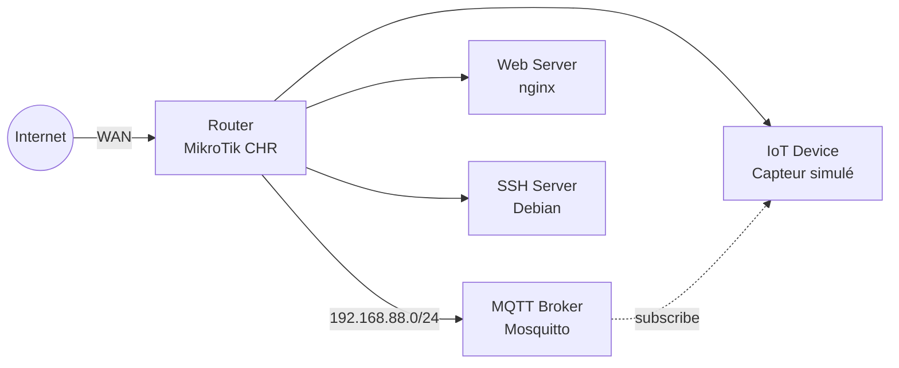

**VMs :** 5
**Réseau :** 1 (192.168.88.0/24)
**Cas d'usage :** Petit déploiement IoT sans budget sécu

---

### A2 — Star (hub central)

Un hub central (gateway IoT) connecte tous les devices.

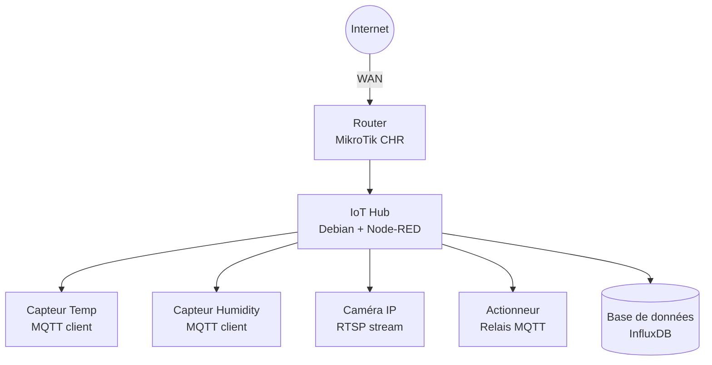

**VMs :** 6-7
**Réseau :** 1
**Cas d'usage :** Smart home, domotique centralisée

---

### A3 — Gateway (DMZ + LAN)

Zone démilitarisée exposée + réseau interne protégé.

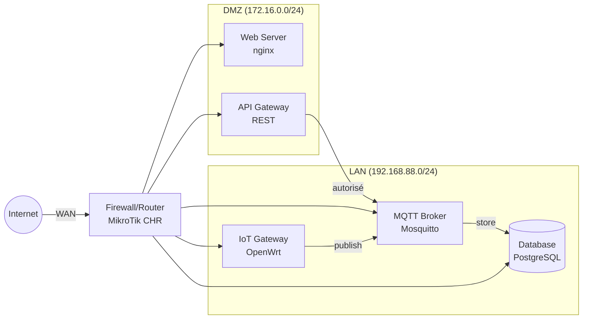

**VMs :** 6-7
**Réseaux :** 2 (DMZ + LAN)
**Cas d'usage :** Plateforme IoT avec portail web public

---

### A4 — Segmenté (2 VLANs + firewall)

Séparation IT / IoT avec firewall inter-zones.

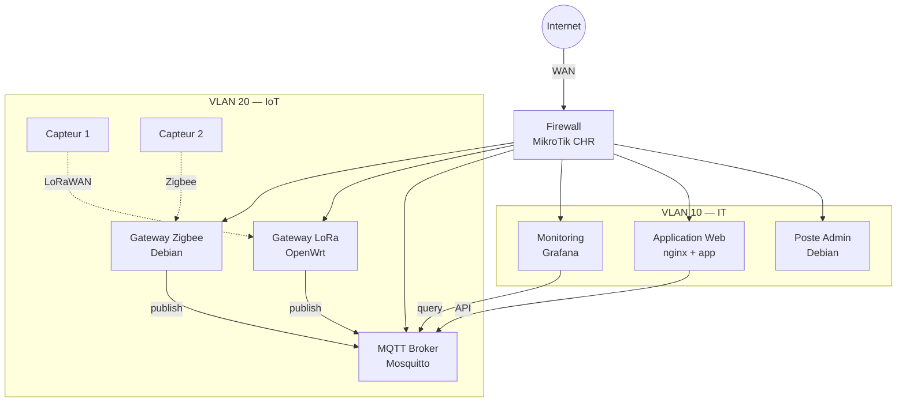

**VMs :** 8-10
**Réseaux :** 2 VLANs + WAN
**Cas d'usage :** Entreprise avec réseau IoT séparé

---

### A5 — Multi-zone (3+ VLANs)

Architecture industrielle avec zones IT / IoT / OT.

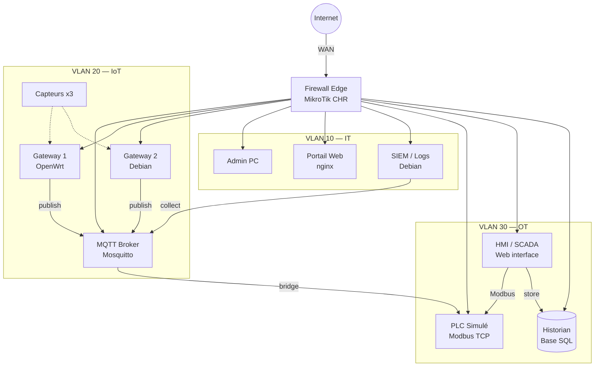

**VMs :** 10-12
**Réseaux :** 3 VLANs + WAN
**Cas d'usage :** Usine connectée, smart building industriel

---

### A6 — Mesh (interconnexion multiple)

Devices qui communiquent entre eux sans point central unique.

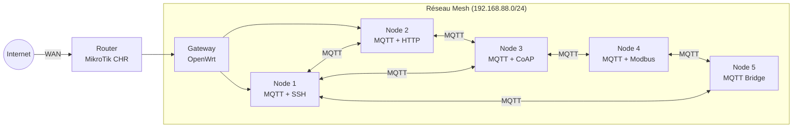

**VMs :** 6-8
**Réseau :** 1 (mais communication pair-à-pair)
**Cas d'usage :** Réseau de capteurs distribué, smart city outdoor

---

### A7 — Edge-Cloud (edge local + cloud)

Architecture avec traitement local (edge) et remontée vers un cloud simulé.

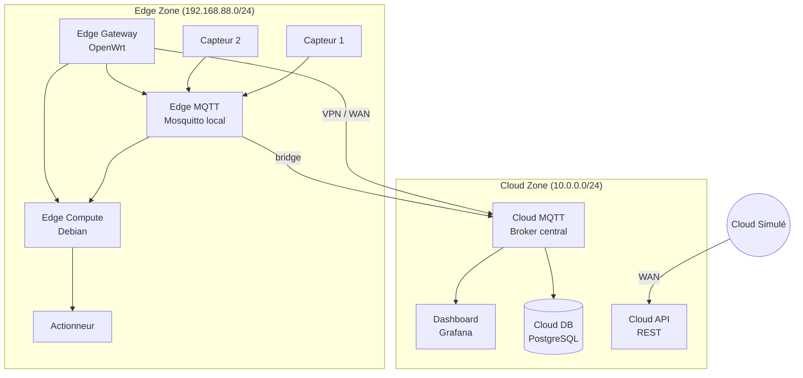

**VMs :** 8-10
**Réseaux :** 2 (Edge + Cloud) reliés par VPN/WAN simulé
**Cas d'usage :** Déploiement IoT avec cloud analytics

---

### A8 — Multi-site VPN (deux sites distants)

Deux sites reliés par un tunnel VPN, chacun avec sa propre infrastructure IoT.

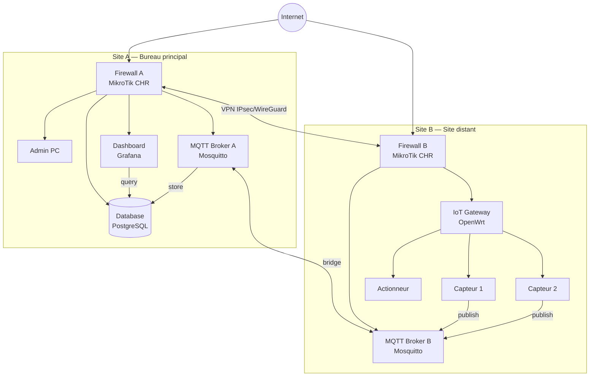

**VMs :** 10-12
**Réseaux :** 3 (Site A LAN + Site B LAN + VPN tunnel)
**Cas d'usage :** Entreprise multi-sites, gestion centralisée IoT

---

---

## Packs de failles

### F1 — Auth faible

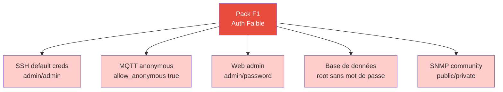

**Injection Ansible :**
- Configurer Mosquitto avec `allow_anonymous true`
- Créer user SSH `admin` / mot de passe `admin`
- Installer MySQL/PostgreSQL sans mot de passe root
- Configurer SNMP avec community string `public`

**OWASP :** #1, #9 | **MITRE :** Initial Access

---

### F2 — Services exposés

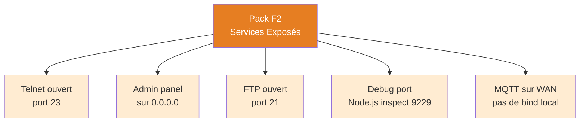

**Injection Ansible :**
- Installer et activer telnetd
- Configurer nginx/app pour écouter sur `0.0.0.0`
- Installer vsftpd avec accès anonymous
- Lancer Node.js avec `--inspect=0.0.0.0:9229`

**OWASP :** #2, #9 | **MITRE :** Initial Access, Discovery

---

### F3 — Software outdated (CVEs connues)

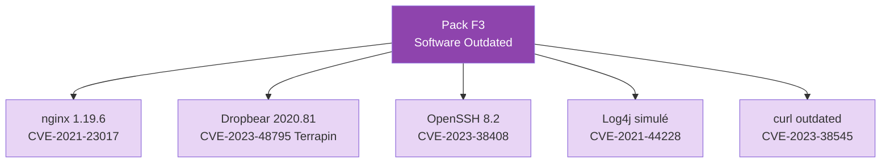

**Injection Ansible :**
- Installer nginx 1.19.6 depuis les archives
- Compiler Dropbear 2020.81 depuis les sources
- Installer OpenSSH 8.2 depuis les archives
- Déployer une app Java avec Log4j 2.14.1

**OWASP :** #5 | **MITRE :** Initial Access, Execution

---

### F4 — Protocoles IoT non sécurisés

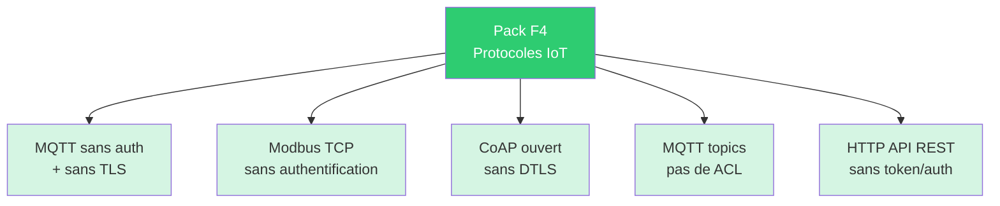

**Injection Ansible :**
- Mosquitto : `allow_anonymous true`, pas de `certfile`
- Installer `pymodbus` simulateur sans auth
- Installer `aiocoap` serveur sans DTLS
- MQTT : pas de fichier ACL, tous les topics accessibles

**OWASP :** #3 | **MITRE :** Impair Process Control

---

### F5 — Firewall / segmentation faible

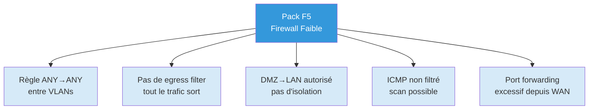

**Injection Ansible :**
- MikroTik : ajouter règle `accept` inter-VLAN
- Pas de règle `drop` en egress
- Port forwarding WAN → services internes

**OWASP :** #2 | **MITRE :** Lateral Movement, Discovery

---

### F6 — Crypto faible

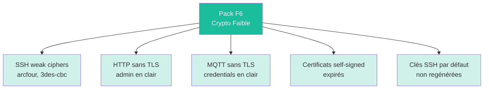

**Injection Ansible :**
- sshd_config : `Ciphers 3des-cbc,arcfour`
- nginx sans bloc `ssl`
- Mosquitto sans `certfile`/`keyfile`
- Générer un certificat expiré avec `openssl`

**OWASP :** #7 | **MITRE :** Collection

---

### F7 — Chaînes de pivot (multi-hop)

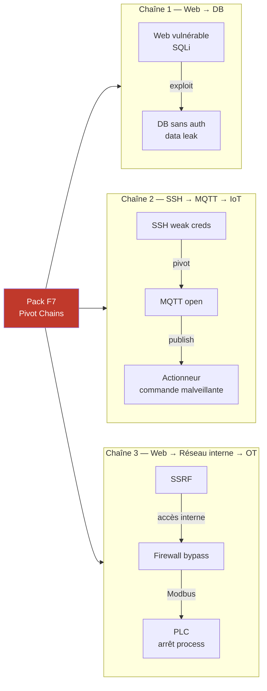

**Injection Ansible :**
- Combiner les failles des autres packs
- S'assurer que le chemin de pivot est exploitable de bout en bout
- Configurer les routes/firewall pour que le chaînage fonctionne

**OWASP :** #3 | **MITRE :** Lateral Movement

---

### F8 — Data exposure (fuite de données)

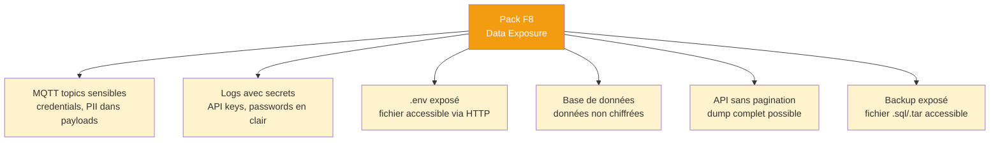

**Injection Ansible :**
- Publier des données sensibles simulées sur MQTT topics (`home/alarm/code`, `system/credentials`)
- Écrire des API keys/passwords dans `/var/log/app.log`
- Placer un `.env` avec des secrets dans le webroot nginx
- Créer une base avec des données PII non chiffrées (noms, emails, tokens)
- API REST qui retourne tout sans pagination ni auth
- Laisser un `backup.sql` dans `/var/www/html/`

**OWASP :** #6, #7 | **MITRE :** Collection

---

### F9 — Attaques réseau actives (DoS, MITM)

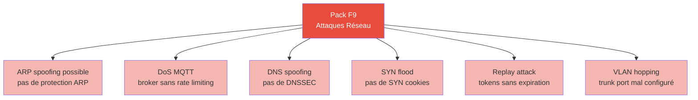

**Injection Ansible :**
- Désactiver ARP inspection sur le switch/routeur
- Mosquitto sans `max_connections` ni `max_inflight_messages`
- DNS local sans validation DNSSEC
- Désactiver SYN cookies : `sysctl net.ipv4.tcp_syncookies=0`
- API avec tokens JWT sans expiration (`exp` très loin)
- Configurer un port trunk sans restriction de VLANs

**OWASP :** #2 | **MITRE :** Impact, Command & Control, Impair Process Control

---

### F10 — Insecure update & management

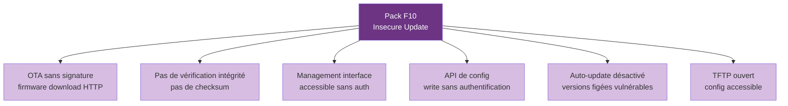

**Injection Ansible :**
- Serveur HTTP avec faux firmware (pas de signature, téléchargeable)
- Pas de fichier `.sha256` ou `.sig` à côté du firmware
- Interface web de management sans login (ex: Node-RED sans auth)
- API REST `PUT /config` sans token
- Figer les versions de tous les packages (pas d'`unattended-upgrades`)
- Installer un serveur TFTP avec les configs accessibles

**OWASP :** #4, #8 | **MITRE :** Initial Access, Execution

---

## Matrice de combinaison

```mermaid
graph TB
    subgraph Architectures
        A1[A1 Flat]
        A2[A2 Star]
        A3[A3 Gateway]
        A4[A4 Segmenté]
        A5[A5 Multi-zone]
        A6[A6 Mesh]
        A7[A7 Edge-Cloud]
        A8[A8 Multi-site VPN]
    end

    subgraph Packs
        F1[F1 Auth faible]
        F2[F2 Services exposés]
        F3[F3 Software outdated]
        F4[F4 Protocoles IoT]
        F5[F5 Firewall faible]
        F6[F6 Crypto faible]
        F7[F7 Pivot chains]
        F8[F8 Data exposure]
        F9[F9 Attaques réseau]
        F10[F10 Insecure update]
    end

    A1 --- F1
    A1 --- F2
    A1 --- F9
    A2 --- F1
    A2 --- F4
    A2 --- F8
    A2 --- F10
    A3 --- F3
    A3 --- F5
    A3 --- F8
    A4 --- F4
    A4 --- F5
    A4 --- F9
    A5 --- F5
    A5 --- F7
    A5 --- F9
    A6 --- F4
    A6 --- F6
    A6 --- F9
    A7 --- F1
    A7 --- F3
    A7 --- F7
    A7 --- F8
    A8 --- F5
    A8 --- F6
    A8 --- F7
    A8 --- F10

    style A1 fill:#3498db,color:#fff
    style A2 fill:#3498db,color:#fff
    style A3 fill:#3498db,color:#fff
    style A4 fill:#3498db,color:#fff
    style A5 fill:#3498db,color:#fff
    style A6 fill:#3498db,color:#fff
    style A7 fill:#3498db,color:#fff
    style A8 fill:#3498db,color:#fff
    style F1 fill:#e74c3c,color:#fff
    style F2 fill:#e67e22,color:#fff
    style F3 fill:#8e44ad,color:#fff
    style F4 fill:#2ecc71,color:#fff
    style F5 fill:#3498db,color:#fff
    style F6 fill:#1abc9c,color:#fff
    style F7 fill:#c0392b,color:#fff
    style F8 fill:#f39c12,color:#fff
    style F9 fill:#e74c3c,color:#fff
    style F10 fill:#6c3483,color:#fff
```

### Scénarios proposés (8 × 10 = 80 combinaisons possibles, 20 sélectionnées)

| # | Architecture | Packs | Difficulté | Vulns | Focus |
|---|---|---|---|---|---|
| S01 | A1 Flat | F1 | Easy | 3-4 | Auth basique |
| S02 | A1 Flat | F2+F9 | Easy | 5-6 | Services + DoS |
| S03 | A1 Flat | F1+F3+F8 | Easy-Med | 8-10 | Auth + CVE + data |
| S04 | A2 Star | F1+F4 | Easy | 5-6 | Auth + protocoles IoT |
| S05 | A2 Star | F4+F8+F10 | Medium | 8-10 | IoT complet |
| S06 | A2 Star | F2+F6+F9 | Medium | 8-10 | Exposition + réseau |
| S07 | A3 Gateway | F1+F5 | Medium | 5-7 | Auth + firewall |
| S08 | A3 Gateway | F3+F5+F8 | Medium | 8-10 | CVE + pivot + data |
| S09 | A3 Gateway | F1+F4+F5+F9 | Med-Hard | 10-12 | Multi-vecteur |
| S10 | A4 Segmenté | F4+F5 | Medium | 6-8 | Segmentation IoT |
| S11 | A4 Segmenté | F1+F3+F5+F9 | Hard | 10-12 | Multi-vecteur |
| S12 | A4 Segmenté | F5+F6+F8+F10 | Hard | 10-14 | Défense en profondeur |
| S13 | A5 Multi-zone | F5+F7 | Hard | 8-10 | Pivot cross-zone |
| S14 | A5 Multi-zone | F4+F5+F7+F9 | Very Hard | 12-16 | Attaque complète IT→OT |
| S15 | A6 Mesh | F4+F6 | Medium | 6-8 | Protocoles + crypto |
| S16 | A6 Mesh | F4+F6+F9 | Hard | 9-12 | Mesh hostile |
| S17 | A7 Edge-Cloud | F1+F8 | Medium | 6-8 | Fuite edge→cloud |
| S18 | A7 Edge-Cloud | F3+F7+F8 | Hard | 10-12 | Pivot edge→cloud |
| S19 | A8 Multi-site | F5+F6+F7 | Hard | 9-12 | VPN + pivot inter-site |
| S20 | A8 Multi-site | F5+F7+F9+F10 | Very Hard | 12-16 | Compromission totale |
