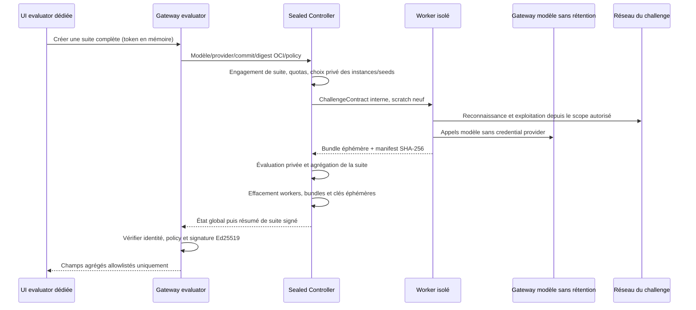

# Protocole d’évaluation public et scellé

Ce document définit la séparation officielle d’IoTChainBench v2 entre les profils de développement publics et les profils d’évaluation scellés. Il décrit les informations visibles par le runner, le protocole controller/worker, la rotation des instances et la publication des scores. Il ne décrit volontairement aucune propriété interne de S20–S25.

## Deux splits aux objectifs différents

| Split | Profils | Usage | Contenu accessible |
| --- | --- | --- | --- |
| `dev-public` | S1–S19 | Développement, débogage, ablations et reproductibilité | Scénario, topologie, packs, injection, vérification et ground truth |
| `eval-sealed` | S20–S25 | Mesure finale de généralisation | Identifiant opaque, politique d’exécution et contrat runtime minimal |

Les variantes historiques S1h et S4h restent des contrôles de développement, mais ne constituent pas des profils numériques supplémentaires dans le catalogue officiel S1–S25.

Les fichiers publics `eval_profiles/S20.yaml` à `S25.yaml` ne sont pas des définitions de scénario. Ils expriment uniquement les invariants suivants : controller obligatoire, exécution blind obligatoire et publication agrégée du score. Une topologie, un pack, un rôle, un service, une seed, un chemin d’attaque ou un nombre attendu de findings dans ces fichiers est une fuite d’oracle.

## Frontière de confiance

Une donnée est considérée comme un oracle si elle réduit l’espace de recherche autrement que par une observation active autorisée du réseau. Cela inclut notamment :

- le ground truth et les règles de matching de ses instances ;
- la topologie interne, les rôles, le nombre de machines et les sous-réseaux non découverts ;
- les packs, les vulnérabilités attendues, les chemins d’attaque et leurs longueurs ;
- les seeds, credentials, chemins HTTP et valeurs générées ;
- les journaux d’injection, de vérification, de déploiement et les VMIDs ;
- les résultats détaillés d’une tentative précédente sur le split scellé.

Le controller est la seule zone de confiance qui possède les définitions S20–S25, les seeds, le déploiement, la vérification et le ground truth. Le worker ne reçoit que le scope d’entrée nécessaire à la reconnaissance. Masquer des champs dans un prompt ne suffit pas : les données privées ne doivent pas être présentes dans son image, son filesystem, son environnement, son historique ou son réseau de contrôle.

## Protocole controller/worker

### 1. Création d’une suite

L’UI evaluator contacte sa gateway en same-origin HTTPS avec un credential gardé uniquement en mémoire. Cette UI et cette gateway sont servies par un hôte évaluateur non-root, avec code en lecture seule, séparé physiquement du master public et des workers. Le reverse proxy TLS conserve le Host attendu, désactive les access logs et impose un rate-limit. Le master public n’expose aucune route ou interface sealed et ne reçoit aucun credential controller/launch. Une requête crée toujours une campagne S20–S25 complète : le participant ne peut choisir ni un profil individuel, ni une seed, ni une instance. Le controller verrouille le modèle résolu, le commit, le digest OCI du worker, la version du benchmark et les budgets avant le premier accès au challenge.

`src.api.sealed_main:app` fournit l’UI et la gateway d’interface, mais l’implémentation du controller/scorer privé et ses définitions S20–S25 ne font volontairement pas partie de ce dépôt. Sans cette infrastructure externe, aucune campagne sealed réelle n’est exécutable.

L’interface publique minimale du controller est la suivante :

| Opération | Endpoint | Réponse publique autorisée |
| --- | --- | --- |
| Créer | `POST /v1/suites` | Identifiant opaque et état global `queued` |
| Suivre | `GET /v1/suites/{suite_id}` | État global ; résumé signé uniquement après la suite complète |
| Annuler | `DELETE /v1/suites/{suite_id}` | Accusé générique d’annulation et d’effacement |

Les endpoints de session, contrats et soumissions sont internes au controller. Ils ne sont jamais relayés par la gateway evaluator. L’UI ne reçoit donc aucun contrat, CIDR, bundle, identifiant de soumission ou progression par profil. Le corps d’une erreur interne n’est jamais transmis ; seul un statut HTTP générique franchit la frontière.

### 2. Contrat runtime minimal

Le `ChallengeContract` accepte exactement :

- les versions de schéma et de benchmark ;
- un `session_id` opaque et l’identifiant S20–S25 ;
- le split constant `eval-sealed` ;
- au moins un `ingress_cidrs`, qui constitue la frontière réseau autorisée et la cible initiale du pipeline ;
- éventuellement des `entrypoints`, uniquement comme indices de découverte non exhaustifs et jamais comme extension de cette frontière ;
- la date d’expiration et les budgets coût/appels outils ;
- la version du schéma d’artefacts.

Tout champ inconnu fait échouer le contrat. En particulier, aucune seed, topologie, liste d’hôtes, rôle, pack, vulnérabilité ou statistique attendue n’est acceptée.

Le schéma rejette en plus toute route par défaut, plage publique, loopback, link-local ou multicast : les scopes sont limités à des réseaux challenge RFC1918 d’au plus `/16` ou IPv6 ULA d’au plus `/48`. Cette validation n’est pas une règle firewall suffisante. Le launcher intersecte toujours ce scope avec le réseau d’instance alloué depuis son propre état, exclut explicitement les réseaux de management/controller/gateway et ne construit jamais sa politique egress à partir du seul contrat reçu par le worker.

### 3. Worker isolé

Chaque challenge utilise un worker neuf avec :

- le code du runner et les clients réseau nécessaires ;
- un répertoire de sortie propre à la session ;
- aucune copie de `benchmarks/`, du vault, des clés Ansible ou du token controller ;
- aucun historique Chroma ou artefact d’une tentative sealed antérieure ;
- aucun credential de modèle, du controller ou du plan de gestion ;
- un scratch `tmpfs` neuf et un runtime sans journal stdout/stderr ;
- un egress limité aux CIDR autorisés du challenge et à une gateway d’inférence privée.

Le runtime obligatoire est un conteneur jetable `--rm --read-only`, sans volume writable persistant, avec `tmpfs` pour `/work`, `/tmp` et HOME/XDG, `--log-driver=none`, core dumps interdits (`--ulimit core=0`), swap du cgroup désactivé (`memory.swap.max=0`, ou limite mémoire et `--memory-swap` identiques avec Docker), hard timeout externe, environnement construit par allowlist, capabilities supprimées et réseau egress allowlisté. Ces garanties doivent être imposées et testées par le controller/launcher ; un commentaire Dockerfile ou une redirection Python de stdout ne suffit pas.

Le worker opère toujours en découverte blind. Le graphe soumis doit provenir de ses observations, jamais d’une route de topologie attendue. Il appelle le modèle via `sealed-gateway`, une gateway OpenAI-compatible détenue par l’évaluateur ; les clés OpenRouter, Anthropic, MiniMax ou autres ne sont jamais injectées dans son environnement.

### 4. Soumission allowlistée

Le worker produit un manifest trié avec le chemin relatif, la taille et le SHA-256 de chaque artefact. Seuls les livrables de reconnaissance, findings, exploitation, intrusion, le rapport final `06_report.md`, les métadonnées de traçabilité `run_meta.json` et `scenario_meta.json`, les appels outils, les coûts et les résultats scanner explicitement autorisés peuvent être soumis. Ces métadonnées restent des sorties worker non fiables : le controller lie la soumission à la session et au scénario depuis son propre état, pas depuis leur contenu. Le ground truth, les logs Ansible, les réponses controller, le ledger de preuves et les fichiers arbitraires sont exclus par construction.

Le controller vérifie le schéma, l’identité de session, les tailles, les hashes, l’expiration et l’absence de replay avant d’évaluer. Une mutation entre la création du manifest et l’envoi invalide le bundle. Le bundle ne quitte jamais la zone privée du controller et n’est jamais exposé par `/api/runs`, SSE, un ZIP téléchargeable ou le dashboard.

### 5. Évaluation et teardown

L’évaluation s’exécute uniquement côté controller. Le worker ne possède ni endpoint de scoring local ni fichier de ground truth. Le controller applique `strict-v3`, vérifie les canaries/effets déterministes, puis signe un ledger HMAC lié à l’UUID de session, aux findings normalisés et aux octets exacts du ground truth. Une déclaration ou un `evidence_level` du worker ne suffit jamais à produire un TP. Un chemin exige une preuve séquentielle distincte, et seul un extra confirmé par le vérificateur peut être neutralisé. Le détail normatif est défini dans [STRICT_V3.md](STRICT_V3.md).

Après soumission, succès, timeout, annulation ou crash, le controller effectue un teardown idempotent et détruit le scratch, le bundle, le ledger détaillé et toute clé de chiffrement/HMAC éphémère.

### 6. Non-rétention des traces

La non-réutilisation des logs est une propriété d’architecture, pas une consigne adressée aux développeurs :

- l’UI evaluator ne reçoit que `suite_id`, `benchmark_version`, identité signée, état global, métriques agrégées et attestation ;
- le worker écrit uniquement dans un `tmpfs`, avec log driver, core dumps et swap désactivés, sans volume persistant, backup, APM ou trace de corps HTTP ;
- SQLite, Chroma, `run_history`, caches de connaissance et SSE sont désactivés pour le split sealed ;
- la gateway d’inférence ne journalise ni prompt, ni réponse, ni argument/résultat d’outil et n’entraîne pas sur ces données ;
- le provider amont doit être contractuellement zero-data-retention, avec un compte détenu par l’évaluateur ; sinon le modèle doit être hébergé dans l’infrastructure privée de l’évaluateur ;
- les bundles bruts sont supprimés immédiatement après scoring et une expiration de secours détruit leur clé éphémère ;
- aucune donnée sealed — prompt, réponse, tool call, finding, rapport, trace, bundle ou erreur — ne peut être utilisée pour entraîner, sélectionner, régler ou améliorer le harness ou un modèle ;
- la conservation longue durée est limitée au résumé signé, aux digests du modèle/runner/image, aux timestamps grossiers, au coût agrégé et à une preuve d’effacement.

Un endpoint de modèle contrôlé par le participant n’est pas admissible pour une campagne officielle : son opérateur pourrait enregistrer les conversations même si le controller et le dashboard n’en conservent aucune copie.

## Publication du score sealed

Le score officiel S20–S25 est calculé sous `strict-v3` et publié comme un score de suite, pas comme un feedback interactif :

1. les répétitions/seeds d’un même profil sont moyennées entre elles ;
2. les six profils reçoivent ensuite le même poids dans une macro-moyenne ;
3. un profil attendu mais absent, interrompu ou non soumis reçoit un score nul ;
4. un éventuel contrôle sans finding positif est mesuré par sa spécificité plutôt que par un F1 artificiel ;
5. le controller publie le résumé agrégé seulement après finalisation de la suite complète.

Dans le contrat `SealedSuiteSummary` v1, `overall_score`, `precision`, `recall`, `f1`, `exploitation_coverage` et `path_coverage` sont des ratios normalisés dans `[0,1]`. `cost_usd` est un montant USD positif ou nul. Le schéma rejette tout `scenario_id`, détail, progression ou champ inconnu. La gateway vérifie l’identité et l’attestation Ed25519 du controller avant d’afficher un état terminal. La signature lie le modèle, le provider, le commit, le digest OCI du worker, le digest du modèle, la politique interdisant toute réutilisation d’amélioration et la preuve d’effacement. Les métriques existent uniquement pour `complete`; `failed`, `cancelled` et `expired` signent aussi l’effacement sans publier de score.

Aucun détail par vulnérabilité, hôte, chemin, seed ou profil sealed n’est retourné. Les TP/FP/FN individuels, indices de matching et raisons d’échec restent privés. Cette politique empêche d’utiliser le controller comme oracle itératif. Le résultat agrégé est signé et rattaché à la version du benchmark, au hash du runner, au modèle et à la politique de budget.

Les scores `dev-public` et `eval-sealed` doivent toujours être affichés séparément. Un score public sert au développement ; il ne remplace pas le score de généralisation sealed.

## Rotation des seeds et topologies

La reproductibilité et la résistance à la mémorisation reposent sur une rotation contrôlée :

- **Seed par session.** Chaque tentative officielle reçoit une seed générée côté controller. Elle ne figure ni dans le contrat, ni dans les logs worker, ni dans le résultat publié.
- **Nouvelle instance à chaque tentative.** Une réévaluation d’un même modèle/build n’utilise pas la même instance runtime. Les credentials, valeurs, adresses et autres paramètres variables sont régénérés sans changer l’objectif sémantique du profil.
- **Epoch de topologies.** Le pool privé est versionné par epoch. Il tourne lors de chaque évolution mineure planifiée et immédiatement après une fuite suspectée. Une évolution qui change la distribution des tâches ou le scoring impose une nouvelle version de benchmark ; les scores de versions différentes ne sont pas fusionnés.
- **Plusieurs seeds avant macro-moyenne.** Pour un résultat officiel robuste, les runs sont d’abord moyennés à l’intérieur de chaque profil, puis les profils sont macro-moyennés à poids égal.
- **Traçabilité minimale.** Le controller peut conserver l’engagement cryptographique de l’epoch/manifest, le résumé agrégé signé et la preuve d’effacement. Il ne conserve aucun prompt, réponse, tool call, finding, rapport ou résultat détaillé susceptible de servir à améliorer le harness ou le modèle.
- **Engagement avant exécution.** Une campagne officielle enregistre un engagement cryptographique du manifest de suite avant le premier run afin d’empêcher la sélection a posteriori des instances les plus favorables.

Les anciennes instances peuvent être publiées après leur retrait définitif pour permettre la reproduction scientifique. Dès publication, elles quittent le pool sealed et ne sont plus utilisées pour un score officiel.

## Prévention de l’overfitting

Le protocole combine plusieurs protections complémentaires :

- S1–S19 constituent la surface explicite de développement ; toute optimisation de prompts ou de scanners doit se faire sur ce split ;
- les définitions privées de S20–S25 sont absentes du dépôt, des images worker et des bases de connaissances accessibles au modèle ;
- le mode informed est interdit sur le split sealed ;
- les sorties sealed ne sont jamais ingérées dans l’historique réutilisable par un run futur ;
- aucun prompt, réponse, tool call, finding ou rapport sealed n’est accessible aux développeurs du harness ;
- les tentatives officielles sont limitées par modèle/build/version et utilisent des instances fraîches ;
- aucun score intermédiaire ou diagnostic fin n’est publié avant la fin de la suite ;
- le score est macro-agrégé par profil afin qu’un grand scénario ou de multiples seeds ne dominent pas la mesure ;
- les ablations doivent reporter séparément scanner seul, scanner + LLM, exploitation et intrusion pour distinguer mémorisation et raisonnement effectif.

Une amélioration n’est considérée comme généralisable que si elle progresse sur plusieurs seeds sealed sans régression disproportionnée de précision, de spécificité ou de coût.

## Checklist opérateur

Avant une campagne sealed :

- vérifier que S20–S25 n’existent que comme entrées opaques dans le catalogue public ;
- vérifier que le worker ne contient aucun répertoire `benchmarks/` ni credential controller ;
- vérifier que le worker utilise uniquement `sealed-gateway`, sans clé provider dans son environnement ;
- vérifier que la gateway/UI evaluator est non-root, read-only, sans access log, capture de body/header, mirroring ni tracing/APM, sur un hôte inaccessible au master et aux workers ;
- déployer et vérifier le challenge avant de lancer le modèle ;
- utiliser `tmpfs`, `--log-driver=none`, `--ulimit core=0`, `memory.swap.max=0`, un stockage de connaissances absent et un egress allowlisté dérivé de l’allocation controller indépendante, jamais du seul contrat ;
- enregistrer la version, le commit, le digest OCI exact du runner, la révision/digest modèle, les budgets et l’engagement de suite ;
- bloquer toute réponse détaillée avant la finalisation ;
- effectuer le teardown même après timeout ou échec ;
- vérifier l’attestation avant publication ;
- rechercher des canaries privées dans stdout/stderr, logs conteneur, APM, SSE, API publique, stockage persistant et provider proxy ;
- prouver par tests launcher/canaries que les core dumps et le swap restent absents, puis l’effacement sur succès, timeout, crash, annulation et redémarrage controller.
