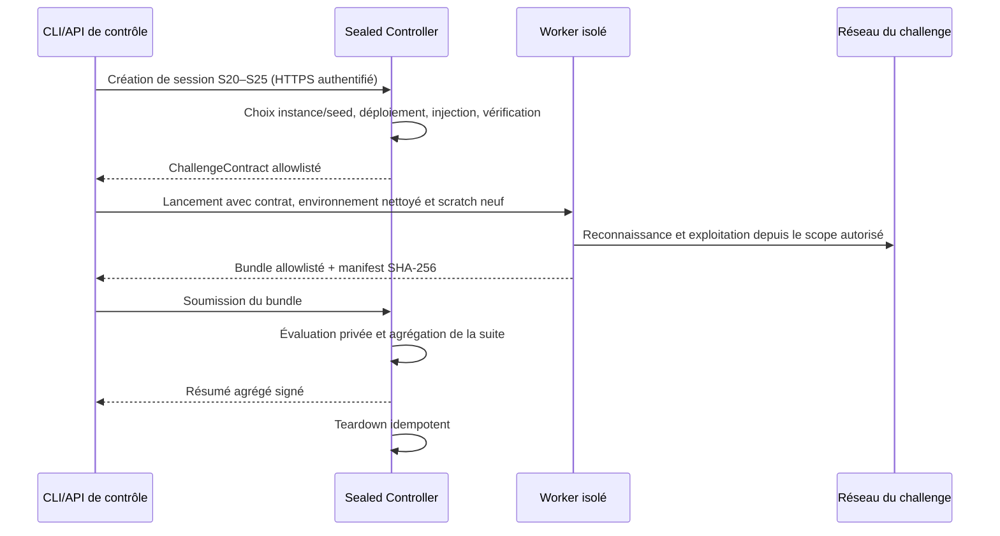

# Protocole d’évaluation public et scellé

Ce document définit la séparation officielle d’IoTChainBench v2 entre les profils de développement publics et les profils d’évaluation scellés. Il décrit les informations visibles par le runner, le protocole controller/worker, la rotation des instances et la publication des scores. Il ne décrit volontairement aucune propriété interne de S20–S25.

## Deux splits aux objectifs différents

| Split | Profils | Usage | Contenu accessible |
| --- | --- | --- | --- |
| `dev-public` | S1–S19 | Développement, débogage, ablations et reproductibilité | Scénario, topologie, packs, injection, vérification et ground truth |
| `eval-sealed` | S20–S25 | Mesure finale de généralisation | Identifiant opaque, politique d’exécution et contrat runtime minimal |

Les variantes historiques S1h et S4h restent des contrôles de développement, mais ne constituent pas des profils numériques supplémentaires dans le catalogue officiel S1–S25.

Les fichiers publics `eval_profiles/S20.yaml` à `S25.yaml` ne sont pas des définitions de scénario. Ils expriment uniquement les invariants suivants : controller obligatoire, exécution blind obligatoire et publication agrégée du score. Une topologie, un pack, un rôle, un service, une seed, un chemin d’attaque ou un nombre attendu de findings dans ces fichiers est une fuite d’oracle.

## Frontière de confiance

Une donnée est considérée comme un oracle si elle réduit l’espace de recherche autrement que par une observation active autorisée du réseau. Cela inclut notamment :

- le ground truth et les règles de matching de ses instances ;
- la topologie interne, les rôles, le nombre de machines et les sous-réseaux non découverts ;
- les packs, les vulnérabilités attendues, les chemins d’attaque et leurs longueurs ;
- les seeds, credentials, chemins HTTP et valeurs générées ;
- les journaux d’injection, de vérification, de déploiement et les VMIDs ;
- les résultats détaillés d’une tentative précédente sur le split scellé.

Le controller est la seule zone de confiance qui possède les définitions S20–S25, les seeds, le déploiement, la vérification et le ground truth. Le worker ne reçoit que le scope d’entrée nécessaire à la reconnaissance. Masquer des champs dans un prompt ne suffit pas : les données privées ne doivent pas être présentes dans son image, son filesystem, son environnement, son historique ou son réseau de contrôle.

## Protocole controller/worker

### 1. Création d’une session

Le control plane contacte le controller par HTTPS avec un credential qui ne doit jamais être copié dans le worker. Le controller choisit l’instance privée, la seed et le réseau, déploie le challenge et vérifie son état avant de répondre.

L’interface controller minimale est la suivante :

| Opération | Endpoint | Réponse publique autorisée |
| --- | --- | --- |
| Créer/préparer | `POST /v1/sessions` | Contrat minimal après vérification |
| Suivre la préparation | `GET /v1/sessions/{session_id}` | `preparing`, `ready`, `running`, `failed` ou `expired` |
| Soumettre | `POST /v1/sessions/{session_id}/submissions` | Identifiant opaque et état d’acceptation |
| Suivre l’évaluation | `GET /v1/submissions/{submission_id}` | État ; résumé signé seulement lorsque publiable |
| Nettoyer | `DELETE /v1/sessions/{session_id}` | Accusé de teardown idempotent |

Le corps d’une erreur controller n’est jamais transmis au worker : une erreur de déploiement ou de vérification peut contenir des informations privées. Seuls un statut générique et un identifiant de requête peuvent franchir la frontière.

### 2. Contrat runtime minimal

Le `ChallengeContract` accepte exactement :

- les versions de schéma et de benchmark ;
- un `session_id` opaque et l’identifiant S20–S25 ;
- le split constant `eval-sealed` ;
- au moins un `ingress_cidrs`, qui constitue la frontière réseau autorisée et la cible initiale du pipeline ;
- éventuellement des `entrypoints`, uniquement comme indices de découverte non exhaustifs et jamais comme extension de cette frontière ;
- la date d’expiration et les budgets coût/appels outils ;
- la version du schéma d’artefacts.

Tout champ inconnu fait échouer le contrat. En particulier, aucune seed, topologie, liste d’hôtes, rôle, pack, vulnérabilité ou statistique attendue n’est acceptée.

### 3. Worker isolé

Chaque challenge utilise un worker neuf avec :

- le code du runner et les clients réseau nécessaires ;
- un répertoire de sortie propre à la session ;
- aucune copie de `benchmarks/`, du vault, des clés Ansible ou du token controller ;
- aucun historique Chroma ou artefact d’une tentative sealed antérieure ;
- aucun accès réseau au controller ou au plan de gestion.

Le worker opère toujours en découverte blind. Le graphe affiché ou soumis doit provenir de ses observations, jamais d’une route de topologie attendue.

### 4. Soumission allowlistée

Le worker produit un manifest trié avec le chemin relatif, la taille et le SHA-256 de chaque artefact. Seuls les livrables de reconnaissance, findings, exploitation, intrusion, le rapport final `06_report.md`, les métadonnées de traçabilité `run_meta.json` et `scenario_meta.json`, les appels outils, les coûts et les résultats scanner explicitement autorisés peuvent être soumis. Ces métadonnées restent des sorties worker non fiables : le controller lie la soumission à la session et au scénario depuis son propre état, pas depuis leur contenu. Le ground truth, les logs Ansible, les réponses controller et les fichiers arbitraires sont exclus par construction.

Le controller vérifie le schéma, l’identité de session, les tailles, les hashes, l’expiration et l’absence de replay avant d’évaluer. Une mutation entre la création du manifest et l’envoi invalide le bundle.

### 5. Évaluation et teardown

L’évaluation s’exécute uniquement côté controller. Le worker ne possède ni endpoint de scoring local ni fichier de ground truth. Après soumission, succès, timeout ou crash, le controller effectue un teardown idempotent de la session.

## Publication du score sealed

Le score officiel S20–S25 est un score de suite, pas un feedback interactif :

1. les répétitions/seeds d’un même profil sont moyennées entre elles ;
2. les six profils reçoivent ensuite le même poids dans une macro-moyenne ;
3. un profil attendu mais absent, interrompu ou non soumis reçoit un score nul ;
4. un éventuel contrôle sans finding positif est mesuré par sa spécificité plutôt que par un F1 artificiel ;
5. le controller publie le résumé agrégé seulement après finalisation de la suite complète.

Dans le contrat `EvaluationSummary` v1, `overall_score`, `precision`, `recall`, `f1`, `exploitation_coverage` et `path_coverage` sont des ratios normalisés dans `[0,1]`. `cost_usd` est un montant USD positif ou nul. Le dashboard convertit les ratios en pourcentages uniquement à l’affichage et ne remplace jamais un coût signé par une valeur issue du run local.

Aucun détail par vulnérabilité, hôte, chemin, seed ou profil sealed n’est retourné. Les TP/FP/FN individuels, indices de matching et raisons d’échec restent privés. Cette politique empêche d’utiliser le controller comme oracle itératif. Le résultat agrégé est signé et rattaché à la version du benchmark, au hash du runner, au modèle et à la politique de budget.

Les scores `dev-public` et `eval-sealed` doivent toujours être affichés séparément. Un score public sert au développement ; il ne remplace pas le score de généralisation sealed.

## Rotation des seeds et topologies

La reproductibilité et la résistance à la mémorisation reposent sur une rotation contrôlée :

- **Seed par session.** Chaque tentative officielle reçoit une seed générée côté controller. Elle ne figure ni dans le contrat, ni dans les logs worker, ni dans le résultat publié.
- **Nouvelle instance à chaque tentative.** Une réévaluation d’un même modèle/build n’utilise pas la même instance runtime. Les credentials, valeurs, adresses et autres paramètres variables sont régénérés sans changer l’objectif sémantique du profil.
- **Epoch de topologies.** Le pool privé est versionné par epoch. Il tourne lors de chaque évolution mineure planifiée et immédiatement après une fuite suspectée. Une évolution qui change la distribution des tâches ou le scoring impose une nouvelle version de benchmark ; les scores de versions différentes ne sont pas fusionnés.
- **Plusieurs seeds avant macro-moyenne.** Pour un résultat officiel robuste, les runs sont d’abord moyennés à l’intérieur de chaque profil, puis les profils sont macro-moyennés à poids égal.
- **Traçabilité privée.** Le controller conserve de façon chiffrée l’epoch, l’identifiant interne d’instance, la seed, les hashes de définition et les résultats de vérification. Ces informations servent aux audits, jamais au worker.
- **Engagement avant exécution.** Une campagne officielle enregistre un engagement cryptographique du manifest de suite avant le premier run afin d’empêcher la sélection a posteriori des instances les plus favorables.

Les anciennes instances peuvent être publiées après leur retrait définitif pour permettre la reproduction scientifique. Dès publication, elles quittent le pool sealed et ne sont plus utilisées pour un score officiel.

## Prévention de l’overfitting

Le protocole combine plusieurs protections complémentaires :

- S1–S19 constituent la surface explicite de développement ; toute optimisation de prompts ou de scanners doit se faire sur ce split ;
- les définitions privées de S20–S25 sont absentes du dépôt, des images worker et des bases de connaissances accessibles au modèle ;
- le mode informed est interdit sur le split sealed ;
- les sorties sealed ne sont jamais ingérées dans l’historique réutilisable par un run futur ;
- les tentatives officielles sont limitées par modèle/build/version et utilisent des instances fraîches ;
- aucun score intermédiaire ou diagnostic fin n’est publié avant la fin de la suite ;
- le score est macro-agrégé par profil afin qu’un grand scénario ou de multiples seeds ne dominent pas la mesure ;
- les ablations doivent reporter séparément scanner seul, scanner + LLM, exploitation et intrusion pour distinguer mémorisation et raisonnement effectif.

Une amélioration n’est considérée comme généralisable que si elle progresse sur plusieurs seeds sealed sans régression disproportionnée de précision, de spécificité ou de coût.

## Checklist opérateur

Avant une campagne sealed :

- vérifier que S20–S25 n’existent que comme entrées opaques dans le catalogue public ;
- vérifier que le worker ne contient aucun répertoire `benchmarks/` ni credential controller ;
- déployer et vérifier le challenge avant de lancer le modèle ;
- utiliser un scratch et un stockage de connaissances vierges ;
- enregistrer la version, le commit du runner, le modèle, les budgets et l’engagement de suite ;
- bloquer toute réponse détaillée avant la finalisation ;
- effectuer le teardown même après timeout ou échec ;
- rechercher des canaries privées dans les prompts, SSE, logs, artefacts et bundles soumis.
